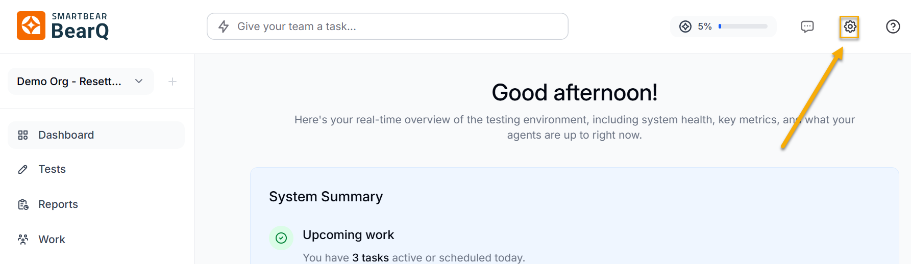
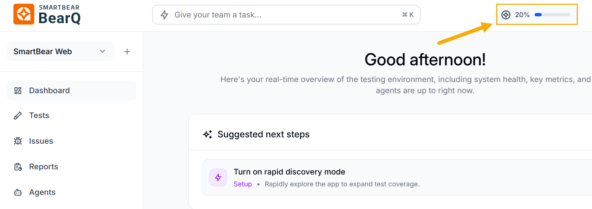
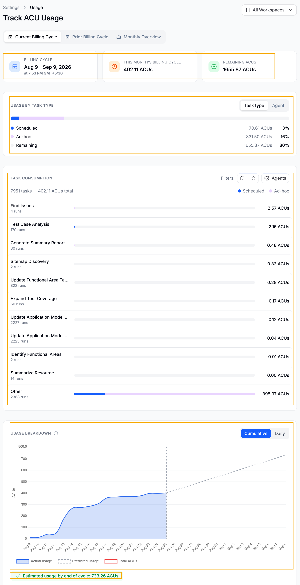
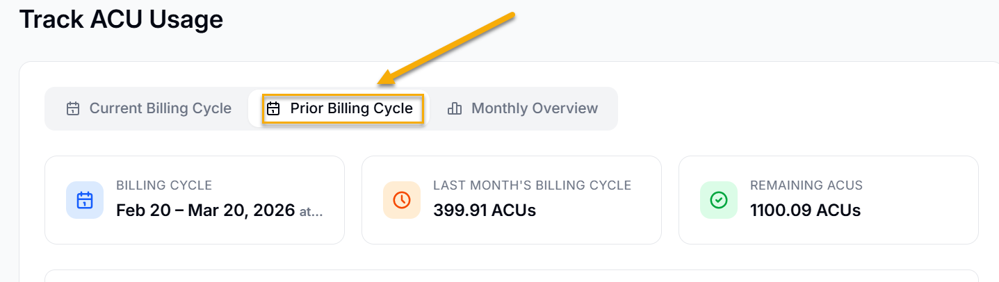

Agent Compute Units (ACUs) show how much system resources BearQ agents use while exploring the application, creating tests, running them, and performing continuous validation. ACUs give you a standard way to measure and track usage across all testing activities.

By tracking ACU usage, teams can understand how resources are used, adjust their testing approach, and make sure they use their allocated capacity efficiently in the billing cycle.

## ACU Usage

The Track ACU Usage page provides a detailed view of resource consumption for the current billing cycle. It enables users to monitor usage trends, identify consumption patterns, and estimate future usage.

You can track your ACU usage by doing the following:

1. Log in to BearQ.
2. Click **Settings**.

   
3. Click **Track ACU Usage**.

:::note
On the dashboard page, click the usage bar to open the **ACU Usage** page directly.

:::

**Track ACU usage**

1. Displays details of the active billing cycle, including the start and end dates, as well as the timestamp and time zone of the latest update. It helps users clearly understand the time period over which BearQ tracks ACU usage.
2. Displays ACU usage details by task type or agent.
3. Displays task consumption, which is the amount of ACU usage in a particular task, filterable by scheduled or ad hoc tasks. You can also filter task consumption by agent.
4. The Usage Breakdown section shows ACU usage over time in a graph, helping users understand how usage changes. You can switch between a Cumulative View, which shows total ACUs used during the billing cycle, and a Daily View, which shows usage for each day. The graph includes Actual Usage, which shows how many ACUs have been used so far, Predicted Usage, which shows expected usage based on current trends, and the Total ACU Limit, which shows the maximum allowed usage. This helps users track patterns, spot sudden increases, and plan their usage to avoid going over the limit.
5. This shows the estimated ACU usage for the rest of the billing cycle based on current usage patterns. This helps teams manage their usage in advance by identifying possible overages, adjusting how often they run tests, or changing the scope of testing to stay within their limits.

Similarly, you can see the prior billing cycle. Click **Prior Billing Cycle**. This will show you the overview of the billing cycle of the previous month.

The monthly overview provides you with the overall usage in all the months and displays the month with the highest usage, along with the units. BearQ sends ACU usage notification emails when usage reaches 80% or 100%, so you can monitor it.

ACUs provide a clear way to track the system effort BearQ uses for testing. The ACU Usage Dashboard shows real-time data, past trends, and future estimates, helping teams manage resources efficiently while keeping testing continuous and reliable.
