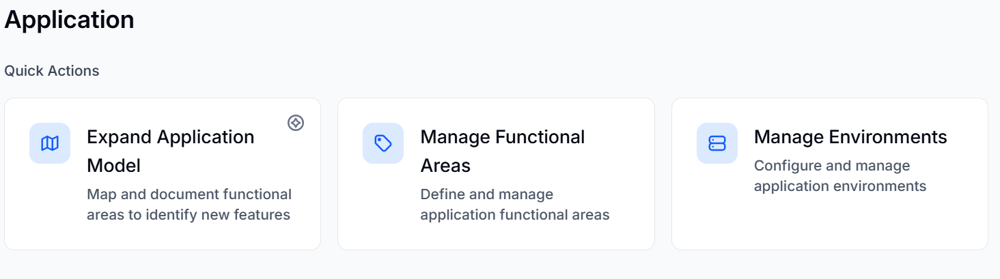

The Application window allows you to **Expand Application Model, Manage Functional Areas, and Manage Environments**. The page also displays the [Application Model](/application/application-model/) and the discovered API endpoints.

To learn more about Expanding the application model, read [Expanding the application model](/application/application-model/).

To learn more about managing functional areas, read [Managing functional areas](/application/functional-areas-in-application-model/).

To learn more about editing environment details, read [Manage Environments](/getting-started-with-bearq/).
