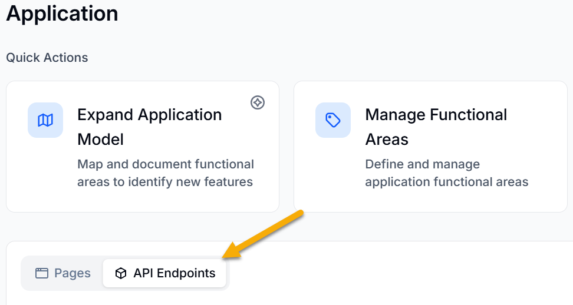
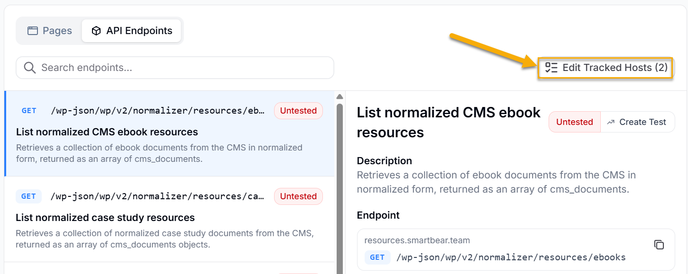
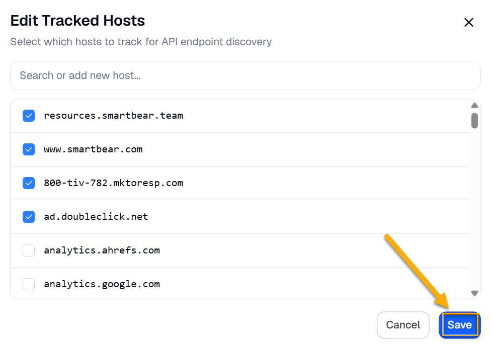
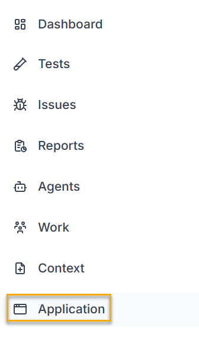
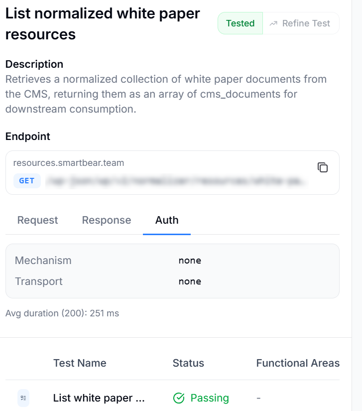

BearQ automatically detects Application Programming Interface (API) endpoints during browser sessions and stores them in the Endpoints section of the Application Model. For each endpoint it discovers, BearQ authors a dedicated API test to provide coverage for that endpoint. API tests in BearQ are structured the same way as UI tests; they are composed of steps, backed by scripts, and run as regression tests. The key difference is that API test steps interact with endpoints directly rather than with UI elements. BearQ authenticates API tests by logging in to the web application and extracting the required authentication tokens from the browser session. You do not need to configure API authentication separately.

## Endpoints in Application Model

The Endpoints section of the Application Model lists all API endpoints that BearQ has discovered. BearQ populates this list automatically as it detects API calls during browser sessions.

Each endpoint includes the following information:

- **URL**: The full address of the endpoint.
- **Method**: The HTTP method used, for example, GET or POST.
- **Description**: A summary of what the endpoint does.
- **Schema**: The request and response structure for the endpoint.
- **Auth mechanism**: How BearQ authenticates requests to this endpoint.
- **Linked test**: The test case BearQ authored to cover this endpoint.

### Manage Tracked Hosts

Before BearQ can author API tests, you must configure which hosts are relevant for testing. BearQ captures all network traffic during browser sessions, including requests to third-party services such as analytics providers, content delivery networks, and advertising platforms that you do not want to test. Use Manage Hosts to specify which hosts BearQ should track and author tests for. Hosts that are not tracked are excluded from the Endpoints section of the Application Model and will not have API tests authored for them.

To manage tracked hosts, do the following:

1. Log in to BearQ.
2. Select **Application**.
3. Select the **Endpoints** tab.

   
4. Select **Edit Tracked Hosts**. Review the list of discovered hosts.

   
5. Enable the hosts you want BearQ to track. Disable any hosts you do not want to test, such as analytics or third-party services.
6. Select **Save**.

   

### Viewing the Endpoints

To view the Endpoints section, do the following:

1. Log in to BearQ.
2. Select **Application**.

   
3. Select API Endpoints.

   
4. In the list, select an endpoint to view its details.

   
