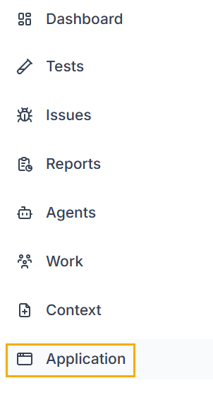
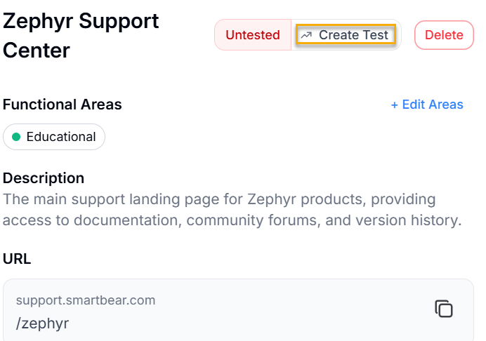
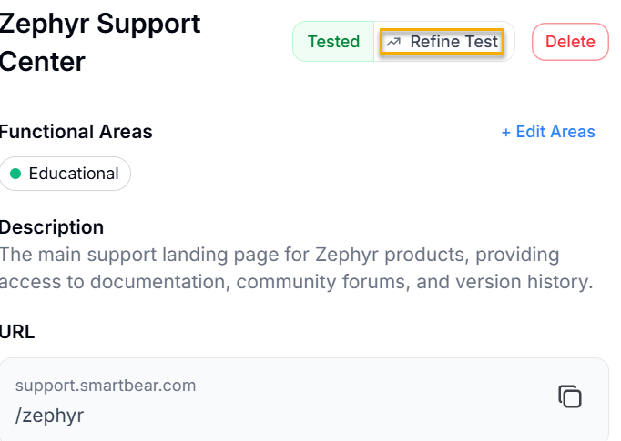
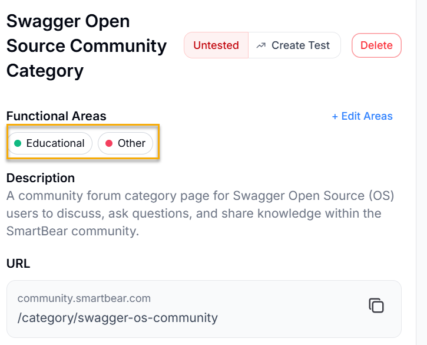

You can create a page test for any page in the Application Model that does not already have one. To create a page test, do the following:

1. Log in to BearQ.
2. Click **Application**.

   
3. In the list, select the page you want to create a test for.
4. In the page detail view, select **Create test**.

   
5. The new page test appears in the test list and is linked to the page in the Application Model.

## Refine a Page Test

You can refine an existing page test from the Application Model to improve its coverage or update it after changes to the page.

To refine a page test, do the following:

1. Click **Application**.
2. In the list, select the page you want to refine the test for.
3. On the page detail view, select **Refine Test**.

   
4. The coverage overlay refreshes after the next test execution.

### View Page Test Coverage

To view the coverage overlay for a page, do the following:

1. Click **Application**.
2. In the list, select the page you want to review.
3. On the page detail view, review the screenshot. The coverage overlay shows green and red boxes over the detected elements.

   
4. To expand the screenshot and see the full coverage view, select the screenshot.
