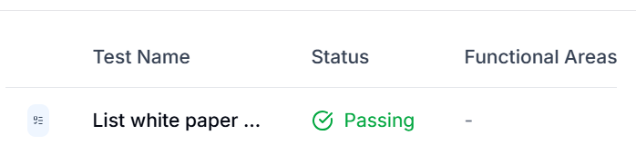
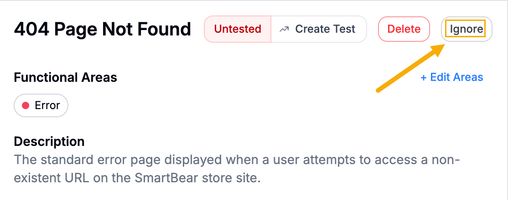

BearQ detects endpoints automatically during browser sessions. You do not need to manually trigger endpoint discovery. When BearQ identifies a new endpoint, it adds it to the Endpoints section of the Application Model and authors a test case for it. BearQ discovers only endpoints that are called during browser sessions. Endpoints that are never called during exploration are not automatically added to the Application Model.

## Endpoint Coverage

Each endpoint in the Application Model is linked to the test case BearQ authored for it. You can view this link on the endpoint detail page. To review endpoint coverage, do the following:

1. Log in to BearQ.
2. Select **Application**.

   
3. Select the **API Endpoints** tab.

   
4. In the list, select the endpoint you want to review.
5. On the endpoint detail page, select the linked test to open the test detail page and review the coverage.

   

:::note
**Ignoring the API endpoints**

Ignoring the API endpoint means BearQ stops autonomously creating tests for that endpoint and excludes it from your coverage calculations. To do the following, click **Ignore** on the API endpoint details page.

:::
