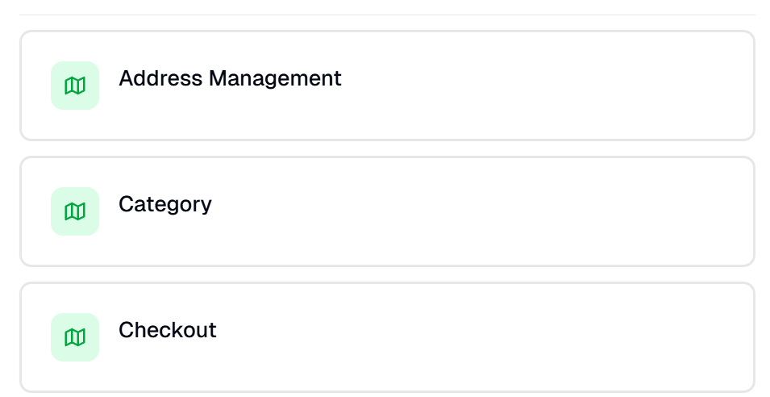
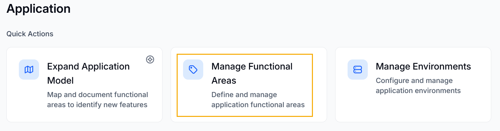
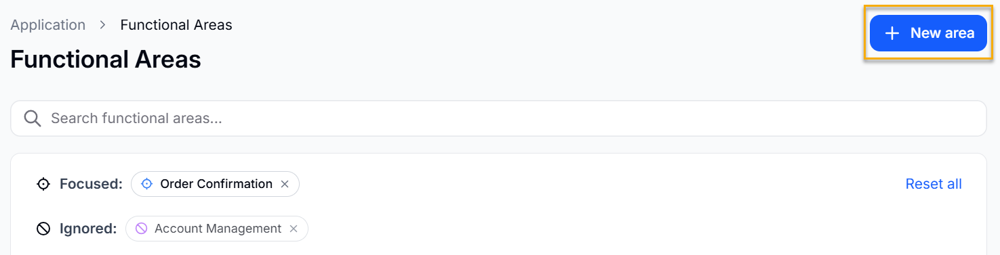
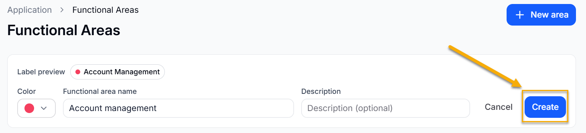
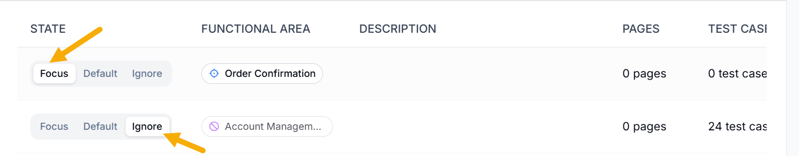

Functional Areas in  help you organize your application into logical groups based on features or workflows. Instead of treating the application as a single system,  divides it into smaller, meaningful sections. This makes it easier to understand, test, and manage different parts of the application.

As  explores the application, it identifies related pages and tests. It then groups them into functional areas based on their connections and use.

For example,  can group features into areas such as:

- Authentication
- User Management
- Reporting
- Checkout

  

Each functional area represents a specific part of the application’s functionality.

This grouping helps  understand how different parts of the application behave together.

Functional Areas in  organize your application into clear, feature-based sections. This makes testing more structured, improves visibility into coverage, and helps teams efficiently manage quality across different parts of the application.

## Managing Functional Areas

To manage Functional Areas in  , do the following:

1. Log in to .
2. Click **Application**. You will be navigated to the Application window.

   
3. Click **Manage Functional Areas**, under **Quick Actions**.

   
4. Click **New Area** to create a new functional area.

   
5. Give the functional area name, a specific color, and a description if you want. Click **Create**.

   
6. Toggle **Focus** to mark a functional area as focused. BearQ uses focused areas to guide exploration when you have not selected a specific functional area. Toggle **Ignore** to exclude a functional area from exploration.

   

### Focused Functional Area

When you focus on a functional area, you tell  agents which parts of the application matter most. Agents give higher priority to focused areas during exploration and testing. Focusing directly affects how  builds its understanding of the application. Agents spend more time exploring the selected areas and improving how those areas are represented in the Application Model. This results in a deeper and more accurate understanding of critical workflows.

Focusing also controls how  expands test coverage. Agents prioritize generating and running tests for the selected areas first, so important features get validated more quickly and more consistently. This helps keep high-impact parts of the application stable. In addition, focusing influences how results appear in reports.  highlights execution results, failures, and trends for focused areas, making it easier to track performance and identify issues where they matter most.
