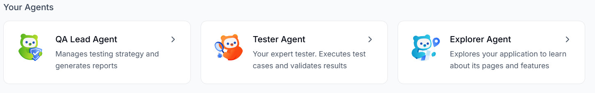

operates through a team of specialized AI agents who work together to manage different stages of the testing lifecycle. Agents form the core of . Each agent has its own set of skills and works with a different perspective, such as exploring the application, creating tests, validating workflows, or providing insights. Together, these agents work like a team and handle different responsibilities of quality assurance. By combining their capabilities, they cover the complete testing process and help ensure the application is tested thoroughly and efficiently. BearQ also uses [External Agents](/external-agents/) to access third-party platforms, issue trackers, collaboration tools, and SmartBear products.

uses the following agents:

- 
- Tester
- Explorer

## Difference Between Various Agents

| Agent Name | Main Role | What the agent does |
| --- | --- | --- |
| QA Lead | Provides testing insights and answers to the queries by users | • Create tests • Edit tests • Create Reports |
| Tester | Validates application behavior | • Runs tests • Checks if results match expected outcomes |
| Explorer | Explores the application to create an Application Model, which is the living map of the application | • Explores pages, elements, and workflows by navigating through the application • Visualize and Expand test coverage |

Each agent handles a specific responsibility, and together they form a complete QA system. They help users explore, test, analyze, and manage application quality more efficiently.
