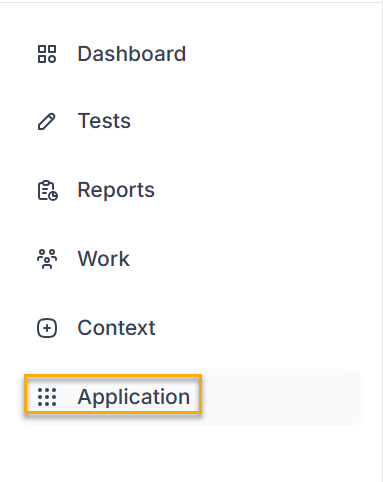
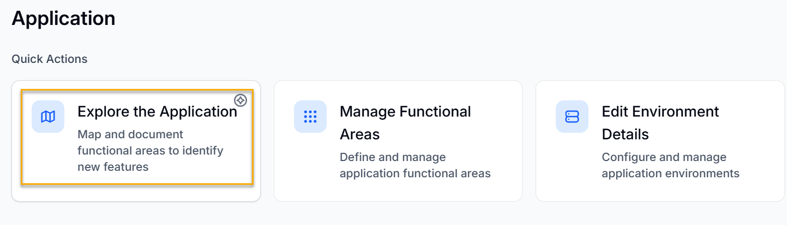
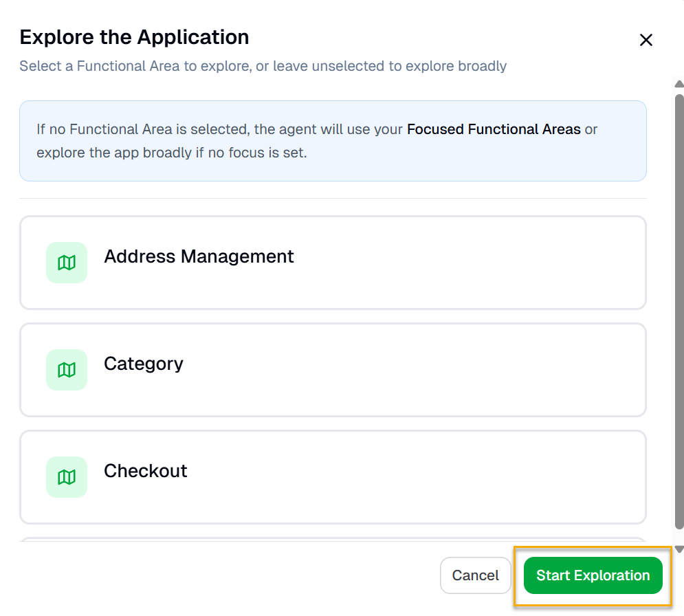
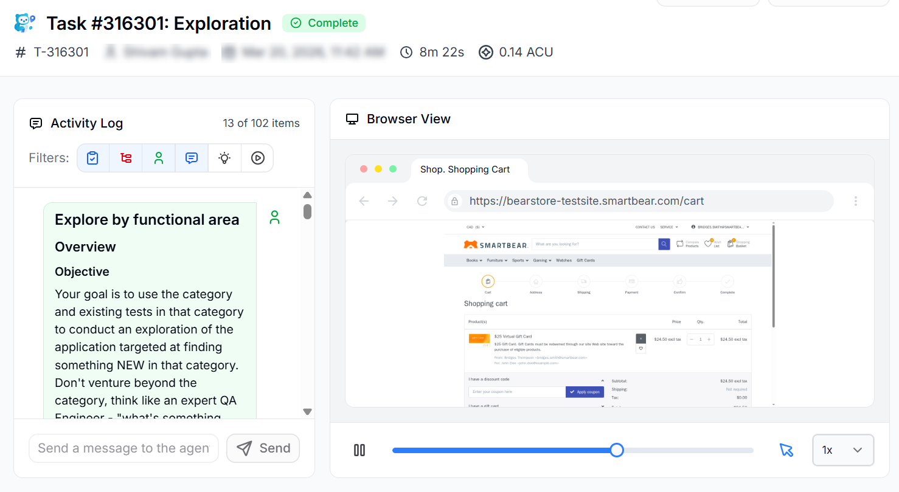

To use the Explorer agent to create an Application Model, do the following:

1. Log in to .
2. Click **Application**. You will be navigated to the Application window.

   
3. Click **Manage Functional Areas**, under **Quick Actions**.

   
4. Select any Functional Area if you want to explore a particular functional area. If you want to explore the application broadly, do not select any functional area. Click **Start Exploration**.

   

The explorer agent will start exploring the application, discovering new workflows and pages.

