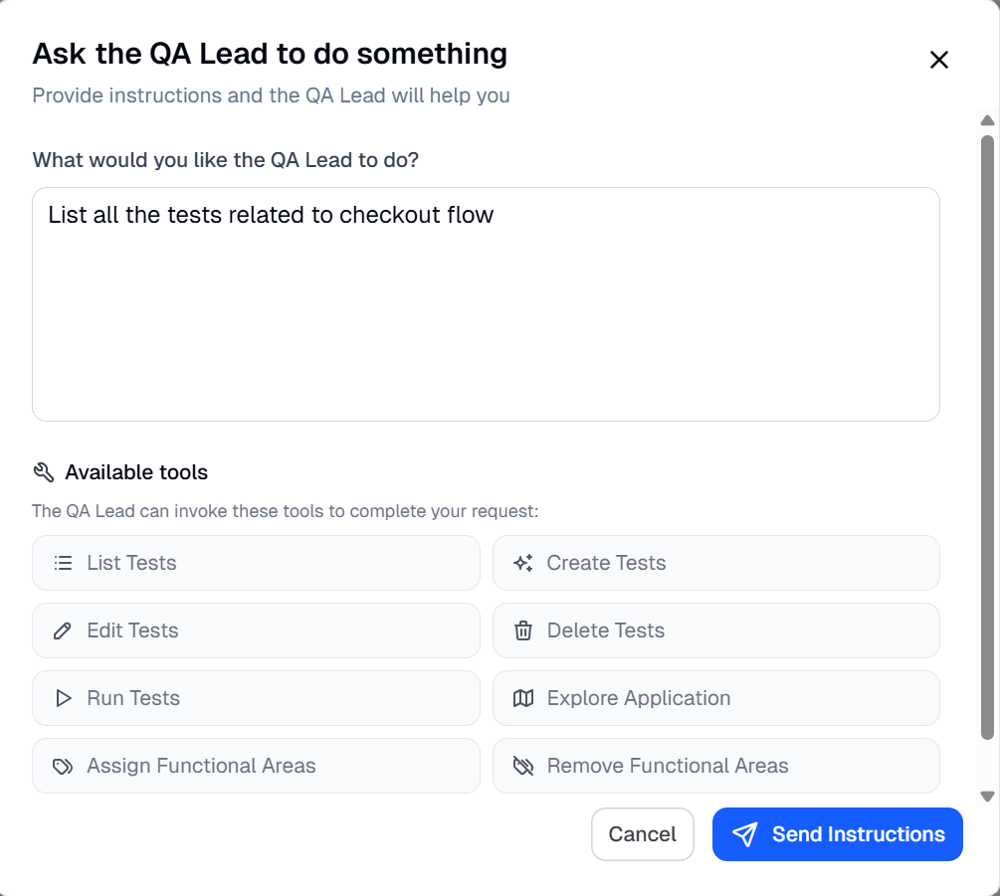
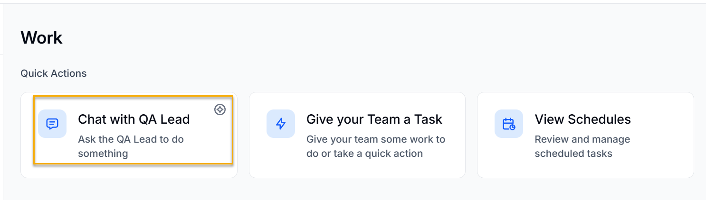
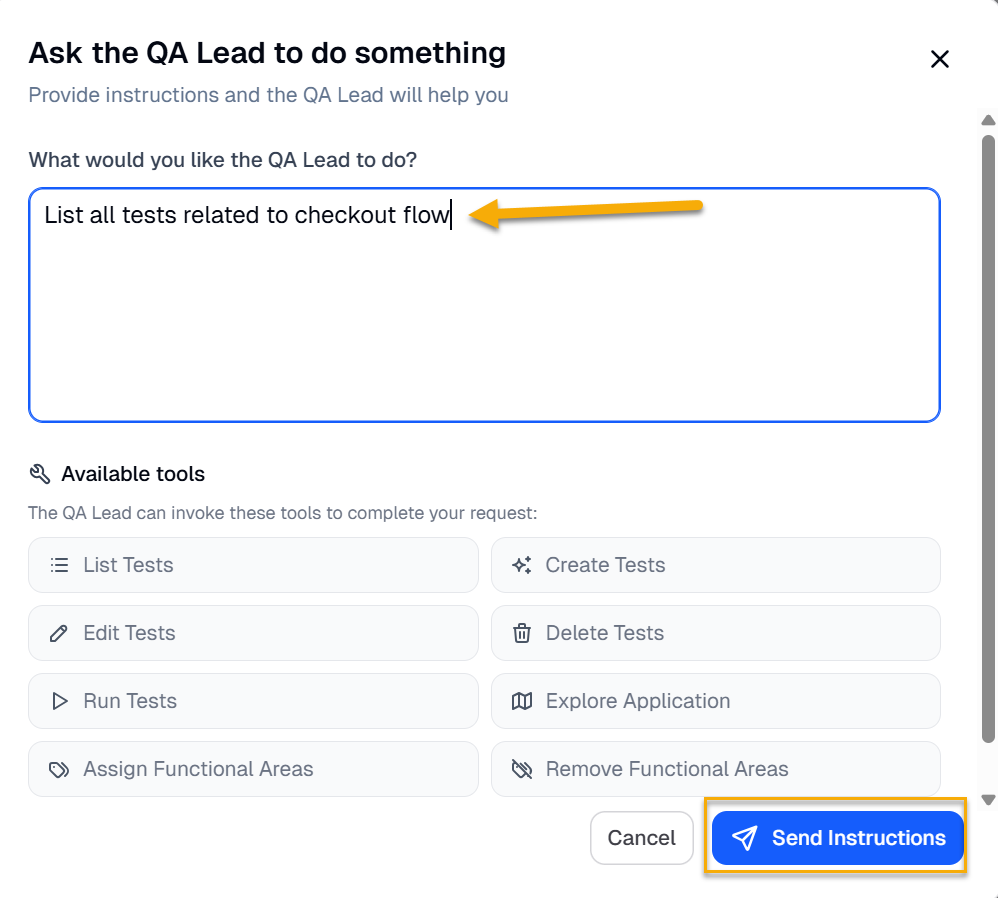
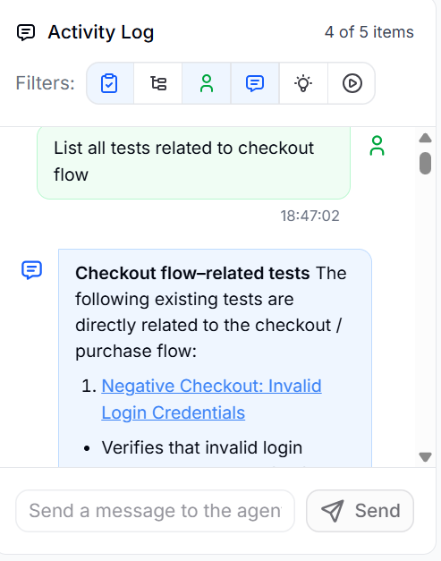

The Quality Assurance (QA) lead agent in  helps manage and guide testing activities across the application. The agent operates at a higher level, providing insights about the tests that are executed, answering user's queries about the tests, and helping users understand test coverage, results, and overall application behavior.

It acts as a central interface that lets users interact with  using simple language and get useful testing information in real time.

The QA lead agent uses the following tools to complete a user's request:

- List tests
- Create tests
- Edit tests
- Delete tests
- Run tests
- Explore application
- Assign functional areas
- Remove functional areas

  

## Capabilities of the QA Lead

The capabilities of the QA lead agent are as follows:

**Ask Questions About Testing Data**

You can simply ask the agent queries like **Show all tests related to checkout**, and the agent will return the names of all the tests related to the checkout functional area.

**Understand Test Coverage**

The QA lead agent provides visibility into which workflows and functional areas are covered and where gaps might exist by analyzing the reports of the tests executed and providing the relevant insights

**Analyze Results Quickly**

Instead of manually reviewing reports by going through each one separately and finding insights on your own, the agent helps you understand which tests passed, failed, or need attention.

**Track Testing Activities**

It gives you a clear view of active, scheduled, and completed testing tasks.

## Communicating with the QA Lead

The QA lead agent uses BearQ’s Application Model, test data, and execution results to respond to user queries. It understands what the user is asking, gathers the relevant information from the system, and presents the results in a clear and structured way.

For example, if you want to get the names of tests related to the checkout flow, you can communicate this directly to the QA Lead Agent. To communicate with the QA Lead Agentt, follow these steps:

1. Sign in to the  application.
2. Click the **Work** tab.

   
3. Click **Chat with QA Lead** under **Quick Actions** in the **Work** section.

   

   :::note
   You can also click the conversation icon, which appears when you point to the **Work** tab, to directly chat with the QA lead agent. 
   :::
4. Write any instruction you want, for example, **List all tests related to checkout flow**. Click **Send instructions**.

   
5. In the **Activity log**, you can see that the result will display a list of all tests related to the checkout flow.

   

This is how you can easily communicate with the QA lead agent and get help whenever required.

## Example Tasks

- Find all tests related to a specific feature (for example, checkout or login)
- Identify failed tests in a particular functional area
- Review recent execution results
- Understand coverage across different modules
- Investigate issues highlighted in reports

The QA lead agent acts as your intelligent QA assistant, helping you quickly understand what’s happening in your application from a testing perspective. Instead of navigating complex dashboards, you can simply ask and get the answers you need to make better, faster decisions.
