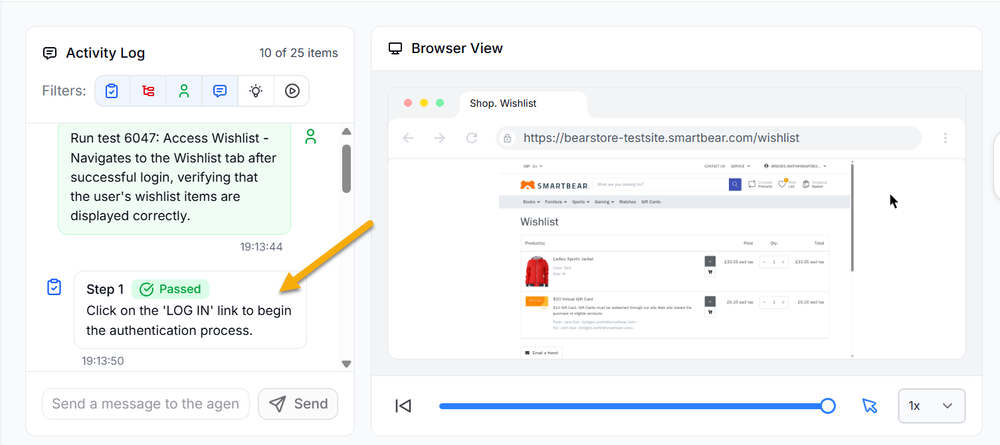

The  Tester Agent checks if your application works correctly by acting like a real user. It runs tests, follows workflows, and makes sure everything behaves as expected.

The Tester Agent checks what actually happens when users interact with the application. It runs each test step by step, performs actions like a user, and verifies the result after every step to ensure the application behaves correctly.

You can follow this process in real time through the **Browser view**, where the Tester agent shows each step it performs. This helps you clearly see how the test runs, what actions are taken, and where any issues occur.

For each action, it checks the outcome against the expected behavior. If the result does not match, it marks the step as failed and records the issue. If the result matches, it moves to the next step in the flow.

## How the Tester Agent Works

The tester agent can do the following:

- Run test scenarios created by users
- Run test scenarios created autonomously by itself and the QA lead agent
- Checks if each step gives the expected result as mentioned in the test case
- Tests edge cases such as invalid inputs, errors, or step failures

The tester agent uses BearQ’s Application Model and test data to perform validations. It follows the given process:

1. Follow a workflow step by step
2. Interact with the application like a user
3. Check whether the expected result is correct.
4. Mark the test as passing or failing

**Example**

For a checkout flow, the Tester agent will do the following:

1. Add items to the cart
2. Apply a coupon
3. Complete the payment
4. Check if the confirmation is shown

If something does not work as expected, the Tester agent reports the issue. It works with the QA lead agent to check if the failure is a regression. If it is a regression, the agent marks the test as failed and includes it in the Daily Report. If it is not a regression and only needs a small fix,  updates the test automatically to make it pass.

The tester agent helps ensure your application works the way users expect. It runs tests, checks results, and gives you clear feedback so you can fix issues quickly.
