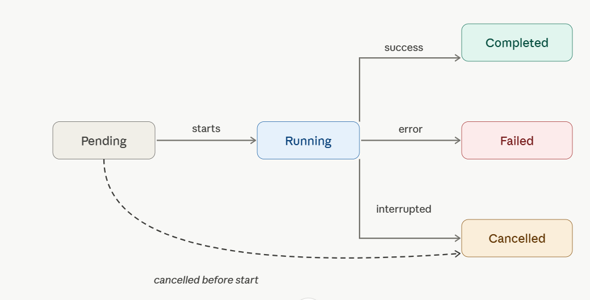

**Base URL:** [https://api.bearq.smartbear.com](https://api.bearq.smartbear.com)

## Introduction

The BearQ Public API lets you create tasks, query information about them, and drive BearQ's agents remotely. It is designed around a simple model: submit work to an agent, receive task IDs, then either poll for completion or open a real-time SSE stream and wait for the terminal event. To learn more, see the [SmartBear MCP BearQ documents](https://developer.smartbear.com/smartbear-mcp/docs/bearq-integration).

### What you can do

- **Kick off QA work programmatically.** Create a task and assign it to a QA Lead, Tester, or Explorer agent via `POST /tasks`.
- **Query task progress.** Poll `GET /tasks/{taskId}/status` to learn when a task finishes, or open `GET /tasks/{taskId}/stream` to be notified the moment it does — no polling required.
- **Follow a task in real time.** Stream live metadata and activity log entries via `GET /tasks/{taskId}/stream`. Works for both running and already-terminal tasks.
- **Inspect task details.** Retrieve full metadata and the complete activity log via `GET /tasks/{taskId}`.
- **Cancel work in flight.** Send `DELETE /tasks/{taskId}` to stop a pending or running task.

### Primary use cases

- **CI/CD pipelines.** Trigger a Tester task on every build, stream each task ID over SSE, and block the pipeline on the `done` event's `testRunStatus`.
- **IDE integrations.** Let a developer kick off an Explorer task scoped to a functional area before pushing changes.
- **Agent-to-agent via MCP.** BearQ exposes the same capabilities through an MCP server, so any agent that speaks MCP can drive BearQ directly.
- **Open-ended automation.** Use the QA Lead agent with a natural-language instruction as a general-purpose escape hatch for work that does not fit a structured flow.

### CI/CD example

Store `BEARQ_API_KEY` as a secret in your CI runner. The script below runs a full test suite, streams all tasks in parallel over SSE, and exits non-zero if any test run fails.

```bash

```

## Authentication

All endpoints except `/health` require an API key passed as a Bearer token in the `Authorization` header. Each key is scoped to a single workspace; all requests act on that workspace's data.

```

```

:::caution
Treat the API key as a secret. Anyone who holds it can act on your workspace.
:::

### How to get an API key

To get an API key, do the following:

1. Verify that you have workspace admin permissions. Non-admins cannot view the API key.
2. Sign in to BearQ at [https://bearq.smartbear.com](https://bearq.smartbear.com) and select **Settings**.
3. Scroll to the **Workspace Settings** panel and copy the value from the **API Key** field.

## Errors

All error responses use the `application/problem+json` format. Use the `type` URI — not `title` or `detail` — to branch in error-handling code, as it is stable across releases.

### Error response shape

```json

```

### Status codes

| Code | Name | When it occurs |
| --- | --- | --- |
| 400 | Bad Request | Malformed request or validation failure — for example, a path parameter cannot be parsed, a required field is missing, or a field has the wrong type. |
| 401 | Unauthorized | The Authorization header was missing, malformed, or did not match a known API key. |
| 404 | Not Found | The requested resource (for example, task ID) does not exist. |

## Endpoints

### POST /tasks — createTask

Creates one or more tasks and assigns them to a BearQ agent. The `agent` field discriminates between three variants. A single request may produce multiple tasks — for example, a Tester request scoped to a functional area creates one task per test case in that area.

On success, poll `GET /tasks/{taskId}/status` for each returned ID, or open `GET /tasks/{taskId}/stream` to be notified of completion without polling.

#### Agents

| Agent | Best for |
| --- | --- |
| qa-lead | Natural-language instructions; chaining multiple capabilities; functionality not yet exposed through other endpoints. |
| tester | Running specific test cases, all tests in a functional area, or all tests with a given tag. Ideal for CI/CD pipelines. |
| explorer | Exploring the application to expand BearQ's understanding and identify new functional areas. Optionally scoped to one area. |

#### Request body

`Content-Type: application/json`. The `agent` field is required and selects which variant's fields apply.

| Field | Type | Agent | Required | Description |
| --- | --- | --- | --- | --- |
| agent | string | all | Yes | Discriminator. One of qa-lead, tester, explorer. |
| instruction | string | qa-lead | Yes | Natural-language description of the work. May be multi-sentence or multi-paragraph. |
| mode | "run" | tester | Yes | run executes regression tests. Each mode only operates on its matching test type — mismatched IDs return 400. |
| testCaseIds | integer[] | tester | No | Specific test case IDs. Mutually exclusive with functionalAreas. Omit both to target every test case of the mode's matching type in the workspace. |
| functionalAreas | (int\|string)[] | tester | No | Areas by ID or name. Creates one task per matching test case. Mutually exclusive with testCaseIds. |
| functionalArea | int \| string | explorer | No | Scope the exploration to a single area by ID or name. Omit for full-application exploration. |

#### Request examples

**QA Lead — add test cases**

```json

```

**Tester — run all regression tests in an area**

```json

```

**Tester — refine specific test cases by ID**

```json

```

**Tester — run every regression test case in the workspace**

```json

```

**Explorer — scope to a single area**

```json

```

#### Responses

| Status | Description |
| --- | --- |
| 200 | Task(s) created |
| 400 | Bad request or validation failure |
| 401 | Invalid or missing API key |
| 404 | A referenced resource was not found |

**200 response body**

```json

```

### GET /tasks/&#123;taskId&#125; — getTaskDetails

Returns full metadata for a task along with its complete activity log. Use this for detailed inspection — for example, displaying progress in a UI or surfacing activity messages to a developer.

For lightweight polling, prefer `GET /tasks/{taskId}/status`. To follow a task in real time, use `GET /tasks/{taskId}/stream`.

#### Path parameters

| Parameter | Type | Required | Description |
| --- | --- | --- | --- |
| taskId | integer >= 1 | Yes | ID of the task. Example: 9183. |

#### Responses

| Status | Description |
| --- | --- |
| 200 | Task found — returns TaskDetailsResponse |
| 400 | Bad request — for example, taskId cannot be parsed as a positive integer |
| 401 | Invalid or missing API key |
| 404 | Task not found |

### DELETE /tasks/&#123;taskId&#125; — deleteTask

Cancels a task that is pending or running. Tasks that have already reached a terminal state (completed, failed, or cancelled) are unaffected — the request still returns 200.

Calling this on an already-terminal or already-deleted task returns 200 with an empty object body.

#### Path parameters

| Parameter | Type | Required | Description |
| --- | --- | --- | --- |
| taskId | integer >= 1 | Yes | ID of the task. Example: 9183. |

#### Responses

| Status | Description |
| --- | --- |
| 200 | Cancelled, already terminal, or already deleted. Body is &#123;&#125;. |
| 400 | Bad request — for example, taskId cannot be parsed as a positive integer |
| 401 | Invalid or missing API key |
| 404 | Task not found |

### GET /tasks/&#123;taskId&#125;/status — getTaskStatus

Returns only the task's current lifecycle status. This is the lightweight endpoint for polling. To avoid polling entirely, open `GET /tasks/{taskId}/stream` and wait for the `done` event.

Recommended CI/CD pattern: Create tasks with `POST /tasks`, then either poll this endpoint for each `taskId` until the status is terminal (completed, failed, or cancelled), or stream each task via SSE for a push-based alternative.

#### Path parameters

| Parameter | Type | Required | Description |
| --- | --- | --- | --- |
| taskId | integer >= 1 | Yes | ID of the task. Example: 9183. |

#### Responses

| Status | Description |
| --- | --- |
| 200 | Task found — returns current status. |
| 400 | Bad request — for example, taskId cannot be parsed as a positive integer |
| 401 | Invalid or missing API key |
| 404 | Task not found |

**200 response body**

```json

```

### GET /tasks/&#123;taskId&#125;/stream — streamTask

Streams a task's metadata and activity log as Server-Sent Events (SSE). Two primary patterns:

- **Wait for the task to finish without polling.** Open the stream and read frames until the terminal `done` event arrives. Useful in CI/CD pipelines that just need the final outcome.
- **Follow a task in real time.** Read each frame as it arrives to surface live progress in a UI or feed activity to an agent.

The stream works for both running and already-terminal tasks. If the task is already terminal when the stream opens, all events are flushed immediately, and the stream closes.

#### Event sequence

Each event is delivered as a standard SSE frame: `event: <name>\ndata: <json>\n\n`. Events arrive in the following order:

| Order | Event | Occurs | Payload |
| --- | --- | --- | --- |
| 1 | metadata | Exactly once, first. | taskId, taskStatus, and metadata — same shape as GET /tasks/&#123;taskId&#125; without activityLog. |
| 2 | activityLogEntries | Zero or more frames. | Non-empty array of activity log entries. First frame carries the backlog (if any); subsequent frames carry new entries as they are emitted. |
| 3 | done | Exactly once, last (normal close). | &#123; status, result, testCaseId?, testRunStatus? &#125;. testCaseId and testRunStatus are always present on Tester tasks, absent otherwise. |
| 4 | timeout | Instead of done if stream times out. | &#123; reason: "max_stream_lifetime_exceeded", message &#125;. Re-fetch GET /tasks/&#123;taskId&#125;/status to get the final status. |

#### Path parameters

| Parameter | Type | Required | Description |
| --- | --- | --- | --- |
| taskId | integer >= 1 | Yes | ID of the task. Example: 9183. |

#### Responses

| Status | Description |
| --- | --- |
| 200 | Stream opened. Frames delivered as text/event-stream until done or timeout event. |
| 400 | Bad request — for example, taskId cannot be parsed as a positive integer |
| 401 | Invalid or missing API key |
| 404 | Task not found |

#### Example stream

```

```

### GET /health — getHealth (unauthenticated)

Liveness probe used by infrastructure to verify the public API is running. Returns the plain-text string `OK` with status 200. This endpoint does not require authentication and is not intended for application use.

| Status | Description |
| --- | --- |
| 200 | Service is running. Body: OK (text/plain). |

## Reference

### Task lifecycle

A task moves through the following lifecycle states. Once it reaches a terminal state, it will not change again.

| Status | Terminal | Description |
| --- | --- | --- |
| pending | No | Created and queued. |
| running | No | Currently being worked on by an agent. |
| completed | Yes | Finished successfully. |
| failed | Yes | Did not complete due to an error. |
| cancelled | Yes | Stopped before completion — by DELETE /tasks/&#123;taskId&#125; or by BearQ internally. |

:::note
For Tester tasks, `taskStatus: completed` (lifecycle) and `testRunStatus: failed` (outcome) can both be true at the same time — the agent finished its work, but the test it ran did not pass. These two fields are distinct.
:::



### TaskMetadata

Returned inside `TaskDetailsResponse` and in the `metadata` SSE event payload.

| Field | Type | Description |
| --- | --- | --- |
| type | AgentType | Which agent owns the task: qa-lead, tester, or explorer. |
| name | string | Human-readable task name derived from its type and payload. |
| parentTaskId | integer \| null | ID of the task that spawned this one, or null if created directly via the API. |
| subtaskIds | integer[] | IDs of tasks this task spawned, in creation order. |
| userId | integer \| null | ID of the user who created the task, or null if created by an automated agent. |
| createdAt | string (datetime) | ISO 8601 timestamp when the task was created. |
| completedAt | string \| null | ISO 8601 timestamp when the task reached a terminal status, or null if still in progress. |
| duration | string \| null | ISO 8601 duration between task start and finish (for example, PT3M34.778S), or null if not finished. |
| acus | number (optional) | Agent compute units consumed. Populated only once the task reaches a terminal status. |
| testCaseId | integer (optional) | ID of the test case being operated on. Always present on Tester tasks, absent otherwise. |
| testRunStatus | TestRunStatus (optional) | Outcome of the test run. Always present on Tester tasks, absent otherwise. |

### TaskMetadata updates

The following changes have been made to the `TaskMetadata` object.

#### **New field — environment**

| Field | Type | Description |
| --- | --- | --- |
| environment | string (optional) | Name of the environment the task ran against. Always present on Tester tasks; absent otherwise. |

##### **Updated Field - ACUs**

| Field | Type | Description |
| --- | --- | --- |
| acus | number \| null | Agent compute units consumed. Always present; null until the task reaches a terminal status. |

### TestRunStatus

Outcome enum for Tester tasks only. Distinct from the task's lifecycle `TaskStatus`.

| Value | Description |
| --- | --- |
| running | The test is currently running. |
| passed | The test completed and all assertions passed. |
| failed | The test completed but one or more assertions failed. |
| queued | The test run is queued but not yet picked up by an agent. |
| error | An unexpected error prevented the test from running to completion. |
| cancelled | The test was cancelled before it could finish. |

### ActivityLog entry types

Each entry in `activityLog` (and in `activityLogEntries` SSE frames) has a `messageType` field. The following types are unstable and may change without notice:

| messageType | Description |
| --- | --- |
| user-message | An input message (task instruction, chat input). |
| agent-message | A message from the agent (response, summary, result). |
| step-message | A completed test step, with its objective, outcome, and the actions taken. |
| action-message | A single browser or tool action taken by the agent. |
| subtask-message | A spawned subtask (for example, QA Lead analysis, refinement attempt, exploration). |
| reasoning-message | Step or action execution reasoning. |

### Problem (error schema)

| Field | Type | Description |
| --- | --- | --- |
| type | string (URI) | Stable URI identifying the problem class. Use this for error-handling logic — it does not change between releases. |
| title | string | Short, human-readable summary of the problem class. |
| status | integer | HTTP status code, repeated for convenience. |
| detail | string | Human-readable explanation specific to this occurrence of the problem. |
| code | string | Stable machine-readable code. Examples: 400-00, 401-01, 404-01. |

## GET /environments — listEnvironments

Returns the environments configured in the workspace associated with the API key.

### Responses

| Status | Description |
| --- | --- |
| 200 | Environment list returned. |
| 401 | Invalid or missing API key. |

**200 response body**

```json

```

### Environment object

| Field | Type | Description |
| --- | --- | --- |
| name | string | Environment name. |
| url | string (URI) | Base URL of the application under test. |
| isDefault | boolean | Whether this is the workspace's default environment. The default environment is used for tasks that do not specify one. |
| createdAt | string (datetime) | ISO 8601 timestamp when the environment was created. |
| updatedAt | string (datetime) | ISO 8601 timestamp when the environment was last updated. |

### POST /tasks — environment field (Tester agent)

The following field has been added to the `POST /tasks` request body for the Tester agent.

| Field | Type | Agent | Required | Description |
| --- | --- | --- | --- | --- |
| environment | string | tester | No | Environment name or URL to run the tests against. Accepts either the environment name (for example, `Staging`) or a URL (for example, `https://staging.example.com`). When omitted, the workspace's default environment is used. |

## Support

Open a ticket at [support.smartbear.com/open-ticket](https://support.smartbear.com/open-ticket) or visit [support.smartbear.com](https://support.smartbear.com).
