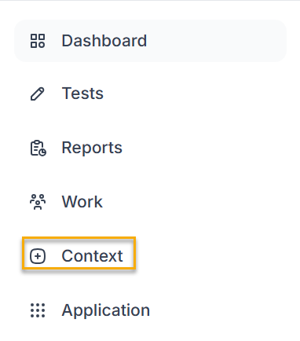
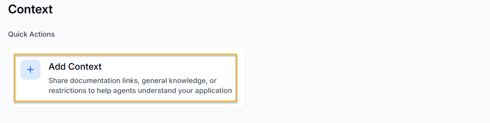
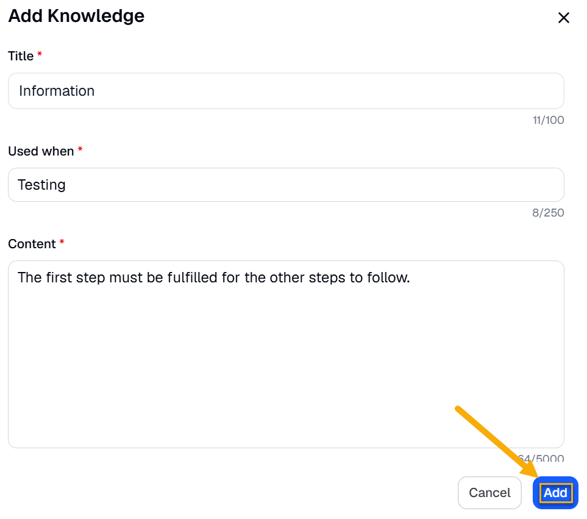
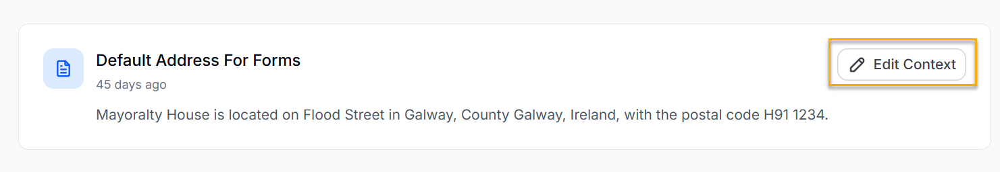
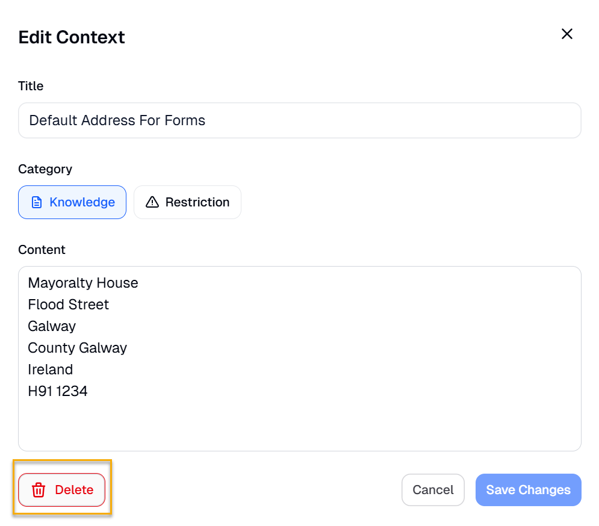

Context is the information you give BearQ about your application, so it can test more accurately. You can add knowledge, such as documentation links or rules about how your application works, and restrictions that tell BearQ what to avoid. BearQ uses this context as a reference when it authors and runs tests. The Context page also shows the context you have already added.

## How context works

BearQ organizes context at two levels, so you can give broad guidance and specific details without overloading every task.

- **Global context**. Each workspace has one global context. BearQ applies it to every task. Use global context for rules and information that should influence all of your testing. For example, use it for how users sign in, or conventions that apply across your whole application.
- **Knowledge (targeted)**. A workspace can have many pieces of knowledge context. BearQ applies each piece only when relevant, rather than adding all of it to every task. This lets you store a lot of detailed information without inflating the cost of every task. Use knowledge for details that apply to particular areas or scenarios.

  The difference matters: global context is always in play, whereas targeted knowledge is applied only when relevant to the work at hand.

**Restrictions**

Restrictions tell BearQ what it must not do during testing, for example, avoiding a destructive action or staying out of a particular area. Add a restriction when you need a guardrail rather than reference information.

**See when context is used**

When BearQ uses a piece of context in a task, it shows this in the task. This helps you spot context that is out of date or incorrect when it affects how a test is authored or run.

To add context, do the following:

1. Log in to BearQ.
2. Click **Context**.

   
3. Click **Add Context**.

   
4. Enter Title, Content, and also write when to use this context.
5. Click **Add**.

   

Your context will be added.

To delete an already added context, do the following:

1. Log in to BearQ.
2. Click **Context**.

   
3. Click **Edit Context**

   
4. Click **Delete**.

   

Your context will be deleted.
