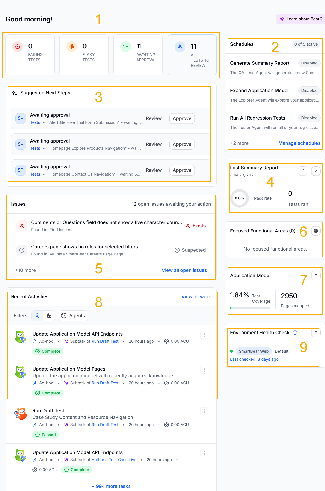
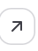
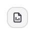
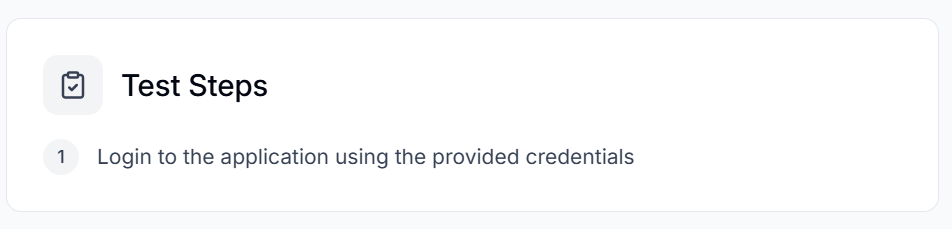
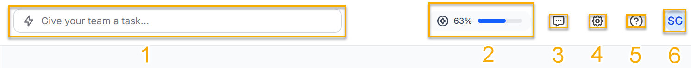
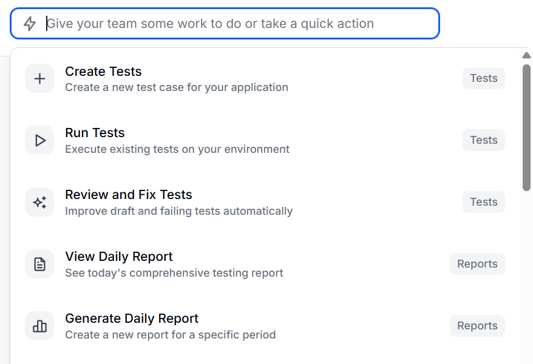
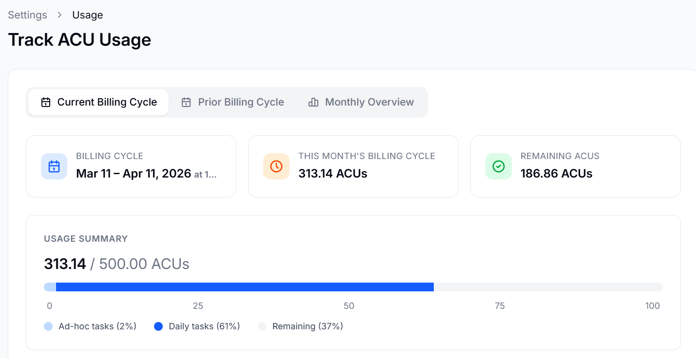
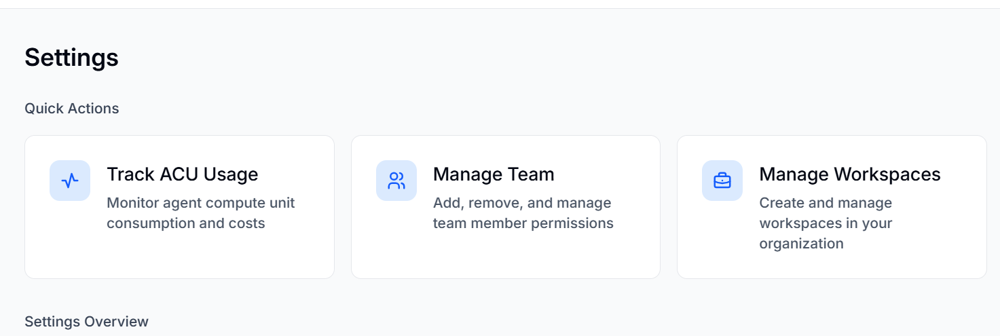

The Dashboard is BearQ's homepage. It gives you a complete overview of the system and helps you quickly understand what is happening in your application. The dashboard shows a system summary, including upcoming tasks and the most recent daily report. It also displays in-progress work, environment status, key metrics such as test execution and results, and recent activity across the system. By bringing all this information together in one place, the dashboard helps you track progress, monitor application health, and identify anything that needs attention.

1. **Types of Tests:** This section displays all the tests including number of failing tests, flaky tests, awaiting approval, and number of all tests reviewed. Selecting any of the tests opens up a list of the test in the particular category.
2. **Schedules:** This section displays the schedules that have been created and are active. You can click**Manage schedules** to manage schedules.
3. **Suggested Next Steps:** This section outlines steps to improve the testing process. It reminds you about the tests that need approval, etc.
4. **Last Summary Report:** This section displays the last summary report, including the pass rate percentage and the total number of tests run. You can click  to view the current report or click  to generate a new report.
5. **Issues:** This section displays the number of issues and their status. You can click on any issue, and the issue detail page is displayed.
6. **Focused Functional Areas:** This section displays the number of focused functional areas in the application.
7. **Application Model:** This section displays the test coverage percentage and total number of pages mapped in the application model.
8. **Recent Activities:** This section displays the recently completed tests. You can filter the tests by ad hoc, scheduled, or agents.
9. **Environment Status**: Displays the health of the application's Environment connected to BearQ. The health indicates whether the environment is working properly or if issues arise during testing. It shows the default test case, which runs by default every time a test is executed. Click **View test case** to view the default test case. For example, in this case, the default test case is the following

   

1. **Give your team a task**: Click this to open a dropdown that lets you create tests, Run Tests, Generate a Daily Report, etc. Click on any of them to execute the task.

   
2. **ACU usage**: Clicking this button opens the **Track ACU Usage** window that displays the Agent Compute Unit usage. This includes the billing cycle, the monthly ACU usage overview, and the usage breakdown. To learn more about ACU usage, refer to Agent Compute Unit.

   
3. **Chat with Support**: Opens a pop-up window where you can chat with our support bot if you have any issues with the application.
4. **Settings**: Opens Settings, where you can manage teams, track ACU usage, and manage workspaces. You can also see and edit User settings and Organization settings. To learn more about settings, read [Settings](/managing-settings/).

   
5. **Documentation**: Opens the BearQ documentation.
6. **Profile**: Click this button, and from the dropdown menu, click **Logout** if you want to log out of the application.

Let's do it !!
