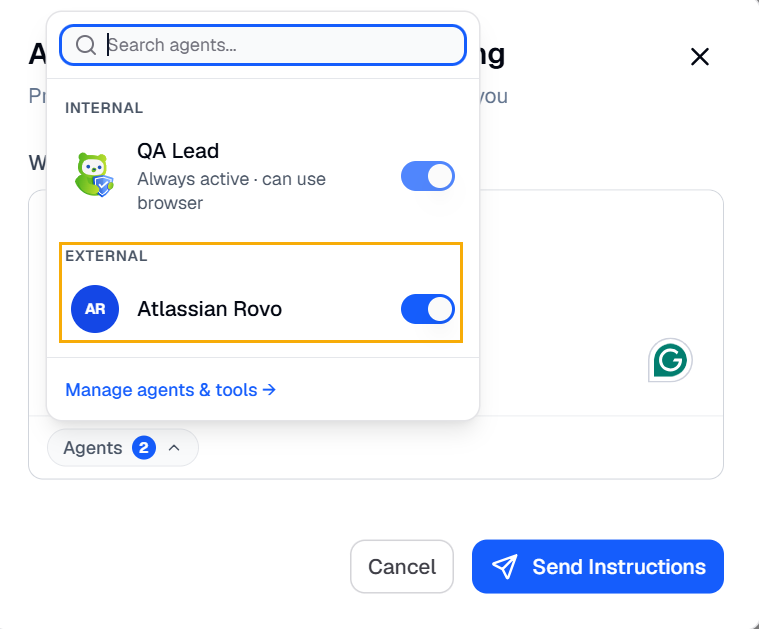
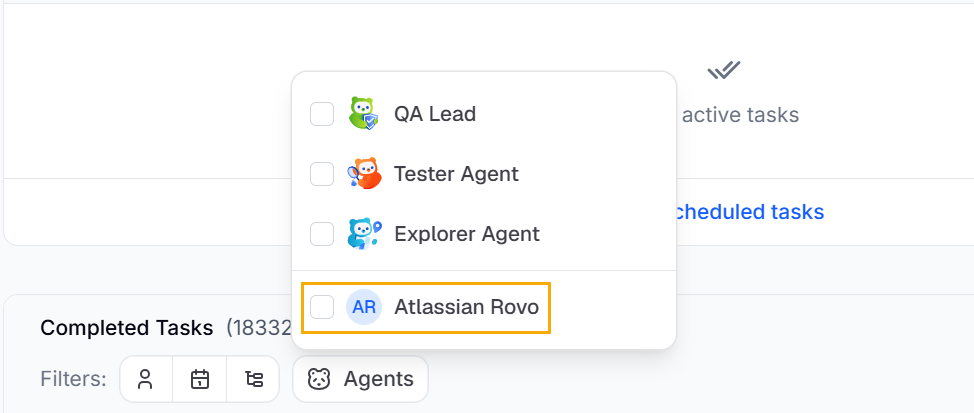

uses external agents to connect with third-party platforms and services. These agents provide  with access to external systems, such as issue trackers, collaboration tools, and SmartBear products.

Instead of building direct integrations for every platform,  uses open standards, such as Model Context Protocol (MCP). This approach simplifies integration management and allows BearQ to support a wide range of tools through a consistent connection model.

connects to external systems through MCP-compatible agents. Users can integrate tools such as Jira and Linear into their testing workflows without maintaining separate API integrations for each product. This approach supports the following capabilities:

- Standardized authentication and connectivity
- Reduced complexity for product-specific integrations
- Easier support for new tools and platforms
- Consistent workflows across integrations

does not support direct API-based integrations. To connect another system, you must connect an external agent, such as:

- SmartBear MCP Server
- Atlassian Rovo MCP Server
- Linear MCP Server
- ClickUp MCP Server

:::tip
Additional MCP-compatible services can also be connected.
:::

External agents are not invoked autonomously.  uses external agents only when the QA Lead executes user-created ad hoc tasks. Users control when and how these agents are used during task execution.

When creating or managing QA Lead tasks, users can control agent access from the **Chat with QA Lead** modal. The agent picker lets users select which external agents are available for a specific task.

allows you to filter tasks that use external agents. Under Agents, select the external agents invoked during task execution.

Each external agent includes its own agent context. This context defines the information, capabilities, and systems available to the agent during task execution. To learn more about context, see [Context](/context/).

Agents can include multiple tools that enable specific functions and workflows within the connected platform. Users can configure these tools based on the connected platform and the supported MCP implementation.

To simplify agent setup,  provides predefined agent configurations, including:

- Atlassian Rovo MCP Server
- Linear MCP Server

These predefined agents help users connect commonly used platforms without additional manual configuration.
