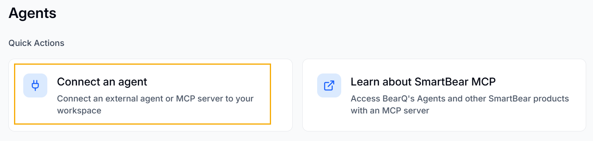
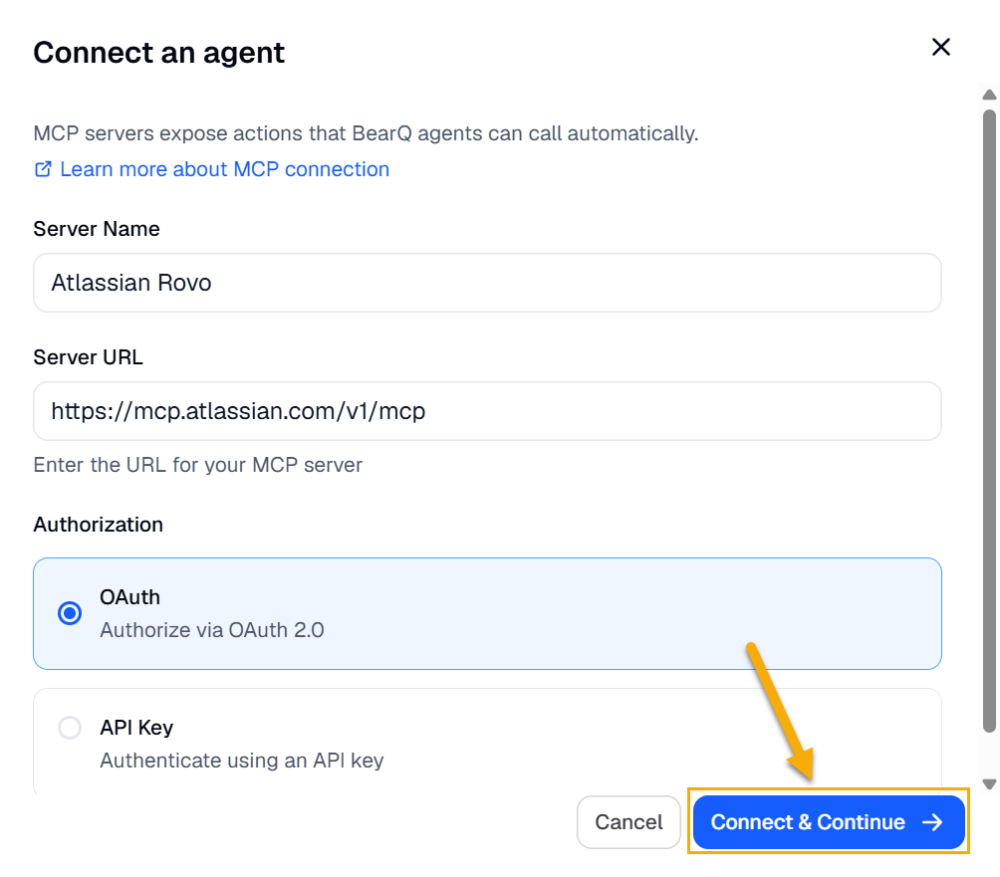
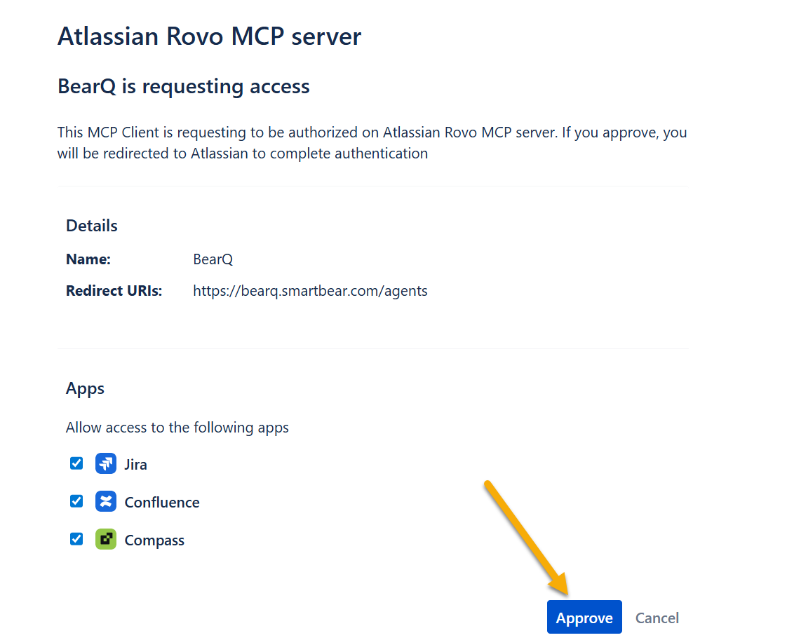
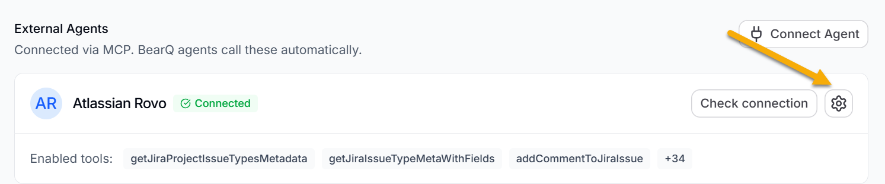
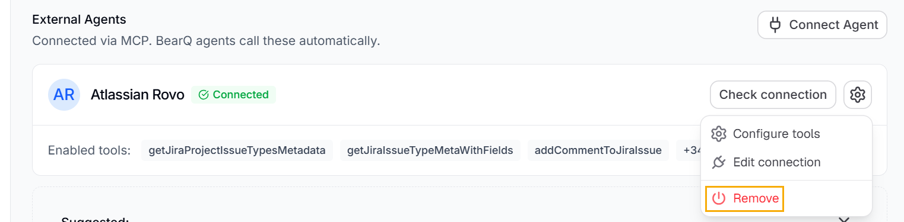

includes a dedicated Agents section in the application sidebar. The Agents page allows you to perform the following tasks:

- View connected agents
- Add new agents
- Remove agents
- Configure available tools
- Manage authentication settings

The page also displays the built-in  agents:

- QA Lead Agent
- Explorer Agent
- Tester Agent

:::note
Built-in agents are currently not configurable.
:::

To connect an external agent, perform the following steps:

1. Log in to .
2. Click **Agents**.
3. Click **Connect an Agent**, under **Quick actions**.

   
4. Enter the Server name, Server URL, and select the required Authorization type.
5. Click **Connect and Continue**.

   
6. After allowing access to the relevant applications, click **Approve**.

   
7. Select the account you want to connect BearQ to and click **Accept**.
8. Click **Save Configuration**. All the available tools in the agent appear in the list.

## Authentication Support

To connect an external agent,  requires the following:

- MCP server URL
- Authentication details

Different MCP servers support different authentication methods.  currently supports the following:

- Header token authentication
- OAuth client credentials

:::note
Some MCP implementations rely on browser-based OAuth authorization flows. Since operates as a remote service, authentication support depends on methods compatible with remote connections. To learn more, read [SmartBear MCP server](https://developer.smartbear.com/smartbear-mcp/docs/mcp-server).
:::

## Removing an External Agent

To remove any connected external agent, perform the following steps:

1. Click the settings button under **External Agents**.

   
2. Click **Remove**, and then select **Remove** in the dialog box.

   
