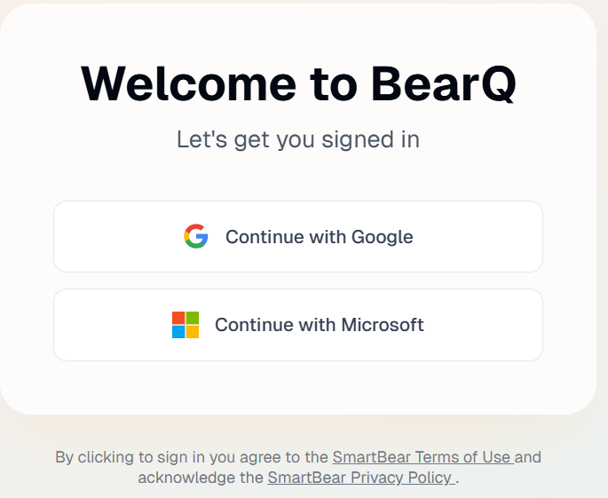
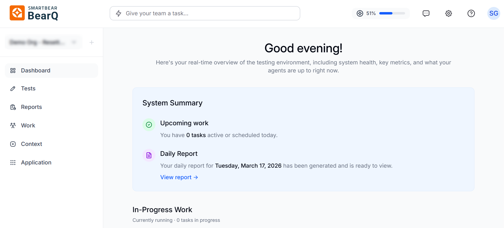
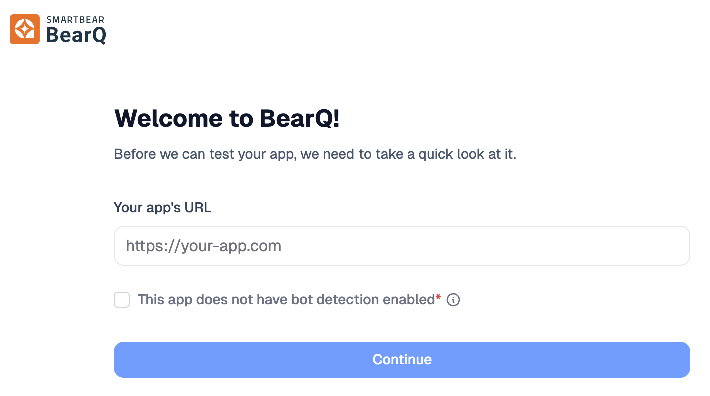
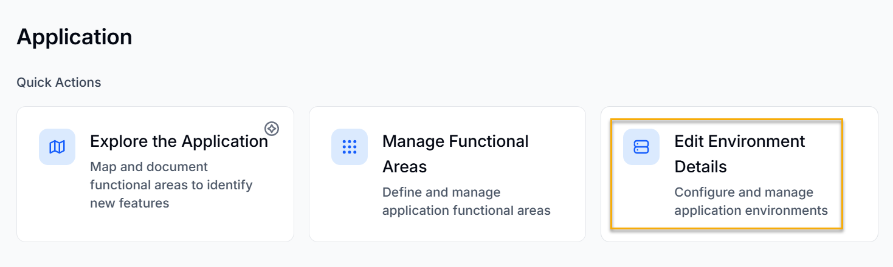

:::note
To access , contact the sales team. They will create an organization for you. Once this setup is complete, you can sign in and start using .
:::

To get started with BearQ, log in to the BearQ application and connect it to your application.

## Logging in to

To log in to the BearQ application:

1. Open the  application.

   **Result**: The login window opens:

   
2. Use the business account from either Google or Microsoft to log in.

Once you log in, the  homepage opens.

## Onboarding Your Application

To onboard your application to BearQ:

1. Log in to BearQ.

   **Result**: The onboarding window opens:

   
2. Enter **Your app's URL**.
3. Answer whether your application blocks bots:

   - Select **No, my app does not block bots** if automated access is allowed.
   - Select **Yes, bots are blocked by CAPTCHA or other protective measures** if your application uses bot protection.
4. Click **Continue**.
5. Choose how BearQ signs in to your application:

   - **No login**. If your application does not require a login, select the no-login option.
   - **Username and password**. Enter the Username and Password that BearQ uses to sign in.
   - **Email MFA**. If your application requires an emailed verification code, set up email multi-factor authentication (MFA).
6. Click **Access the app**.

### Set up Email MFA during onboarding

If your application's login requires an emailed verification code, BearQ signs in using an email account at your workspace's email subdomain. Each workspace has a unique email subdomain, in the form @&lt;workspace>.&lt;org>.&lt;bearq.smartbear.com>. BearQ receives verification emails at this subdomain and reads the code to complete the login.

BearQ needs a working login before it can access your application, so you set up the email user first:

1. During onboarding, indicate that your application requires email MFA.
2. In your application, create a login user whose email address uses your workspace's BearQ email subdomain. The address must match your workspace's email domain.
3. Read any verification message for that user in the BearQ workspace inbox. See View the workspace inbox.
4. Confirm that the user can sign in to your application.
5. Back in BearQ, select the **Email MFA Recipient**. This is the address that BearQ watches for verification codes. If only one address is available, BearQ selects it for you.
6. Continue onboarding.

## Connecting BearQ to Your Application

To connect BearQ to your application:

1. Log in to the BearQ application with administrator credentials.
2. Once you are on the homepage, click **Application**.
3. You will be navigated to the **Application** page. Under Quick actions, click **Edit Environment Details**.

   
4. You can either add another environment by selecting **Add environment** or edit an existing environment configuration by selecting **Edit** .
5. You can add the name and URL, and also select the environment as the default by selecting **Set as a default environment.**
6. Select **Authentication**. Choose the **login type**. Select Login requires Email verification for Email MFA.
7. Select **Advanced**. Add other details such as Cookies, Local Storage, and Extra HTTP Headers.
8. After making the required changes, click **Save**.

Your application is now connected to BearQ.
