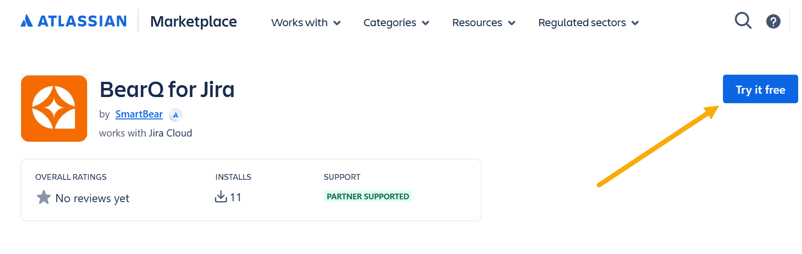
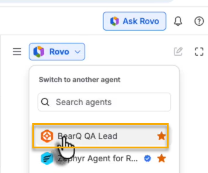
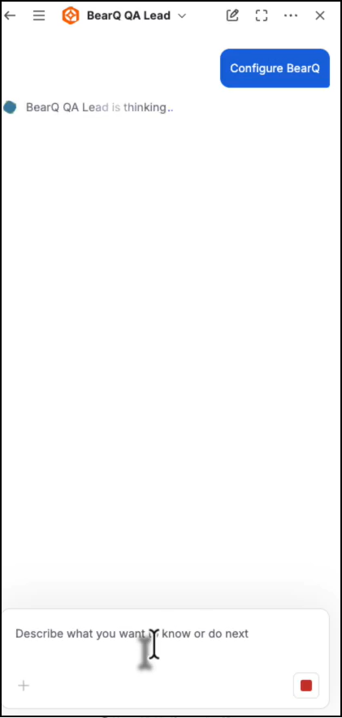
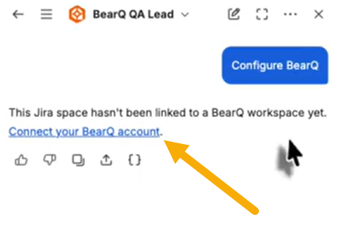
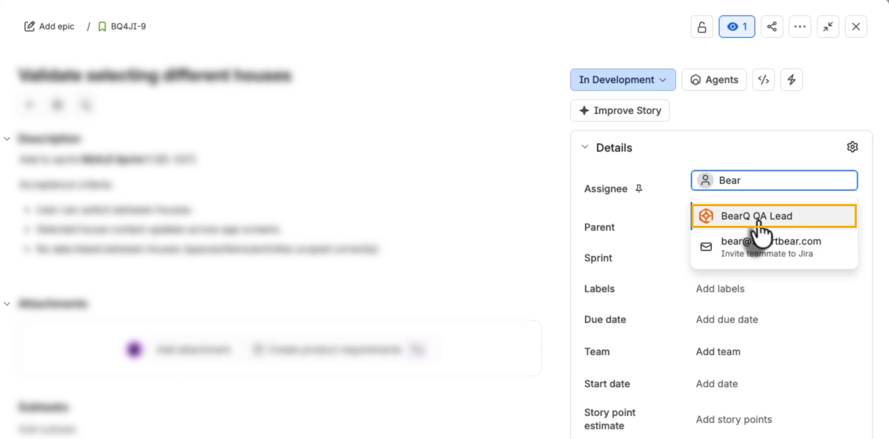

## Overview

The BearQ for Jira integration brings BearQ into Jira as an AI agent that you work with directly on your work items. Installing BearQ for Jira from the Atlassian Marketplace is all you need. You do not install BearQ separately.

After you install the app, you start onboarding by interacting with the agent. BearQ then creates your organization, workspace, and environment for you. Once setup is complete, you can assign the agent to a work item, mention it in a comment, or chat with it. BearQ authors and runs tests for your application, then reports back on the work item. This lets your team keep testing where the work is already tracked.

## How does the Integration work

The integration connects three components: your Jira site, a BearQ workspace, and the BearQ agent running in Jira.

- Each Jira site links to one BearQ workspace, and each BearQ workspace links to one Jira site.
- When you assign or trigger the BearQ agent on a work item, BearQ's QA Lead picks up the request, authors test cases, and runs them against your application.
- BearQ reports its results back on the work item, where you can review and approve them without leaving Jira.

### Prerequisites

Make sure that you have the following:

- A Jira Cloud site with AI agents enabled. A site administrator enables Rovo and Jira AI features for the site.
- Permission to add and use AI agents in Jira.

You do not need a BearQ account or workspace beforehand. BearQ creates your organization, workspace, and environment during onboarding, which starts the first time you interact with the agent. If you do not already have a BearQ subscription, you can start a trial during onboarding.

#### Setting up the Integration

To set up the BearQ agent, do the following:

1. Install BearQ for Jira from the Atlassian Marketplace. This is the only installation you need. After it installs, the BearQ QA Lead agent is available in your Jira site.

   
2. Ask Rovo to configure your BearQ instance. To do that, follow these steps:

   1. Select **Ask Rovo** in the top-right corner of the screen to open the Rovo side panel.

      
   2. Select the agent selector dropdown, labeled Rovo by default, and search for the BearQ QA Lead agent.

      
   3. Send any message to the agent, for example, "Configure BearQ".

      
   4. Follow the link the agent returns to set up your BearQ workspace.

      

   Instead of chatting, you can start onboarding in either of these ways:

   - Assign a work item to the BearQ agent using the Assignee field.

     
   - Mention the agent in a comment on a work item.

   Each of these also returns the onboarding link.

Follow the link the agent returned and complete onboarding in BearQ. This one-time setup creates your BearQ organization, workspace, and environment. When you finish, BearQ guides you back to Jira. After onboarding, the integration is fully functional. You have a working BearQ organization, workspace, and environment, and you can start assigning testing work to the agent.

#### What you can do with the Agent

You can ask the BearQ agent to help with testing for a Jira work item. The agent can do the following:

- **Author test cases from a work item**. BearQ generates test cases based on the work item's summary, description, and acceptance criteria.
- **Run tests against your application**. BearQ runs the tests it authors and reports the results.
- **Report back on the work item**. Results and a short summary appear in the work item's Agents panel, where you approve the work.
- **Answer questions about the agent's work**. Mention the agent in a comment to ask about its activity, for example, when it last ran a test.
