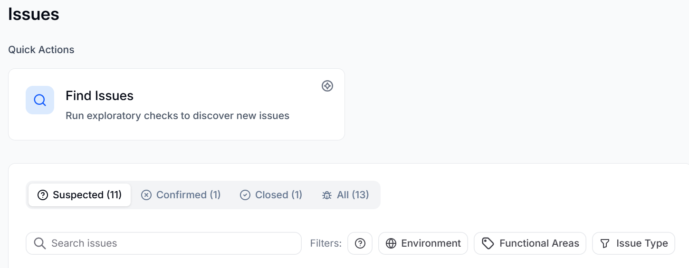

automatically detects actionable issues in your application at all times, not just during dedicated scans. Whether  is exploring your application, running regression tests, or running a **Find Issues** task, it continuously watches for problems and surfaces them on the **Issues** page.

Unlike regression tests, which identify problems that appear after a previously passing test fails, issues cover a broader range of problems, including bugs that may have existed since the application was first tested.  also detects poor UX patterns, accessibility violations, performance problems, and data inconsistencies.

When  detects a problem, it organizes the finding on the **Issues** page with full metadata so you can review, investigate, and act on it.  does not create duplicate issues. If multiple test runs encounter the same problem,  records it as a single issue.

## Issue types

categorizes issues into the following types:

- **Bug**: Unexpected behavior or broken functionality.
- **Accessibility**: Violations of accessibility standards.
- **UX/UI**: Usability problems or poor interaction patterns.
- **Performance**: Slowness or resource inefficiency.
- **Data**: Data validation errors or inconsistencies.
- **Regression**: A behavior that broke after previously working correctly.

## Issue lifecycle

Each issue moves through the following states:

- **Suspected**:  has detected a potential problem but has not yet verified it.
- **Confirmed:**  has verified the issue. A confirmed issue is a reliable finding that your team can act on. A suspected issue becomes confirmed after it is verified.
- **Closed**: The issue has been resolved or dismissed. This happens when it is closed manually or when a linked test passes. You can close an issue in the following ways:

  - **Resolve**: The problem has been fixed.
  - **Ignore**: The behavior is known or intentional and does not require action.

:::note
Verify the exact status and action labels against the live UI before publishing this section.
:::

## Act on an issue

When you want to address an issue,  gives you the following options.

**Link to a ticket or create a new one**

You can link an issue to an existing ticket in your issue tracker or create a new ticket directly from the issue details page. Creating a ticket requires a connected external agent such as Jira or Linear. To connect an external agent, go to **Settings** and select **Agents**.

**Link to a test or create a new one**

You can link an issue to an existing test case or create a new test directly from the issue. Creating a test from an issue gives BearQ the reproduction steps it needs to author a reliable regression test for that specific problem.
