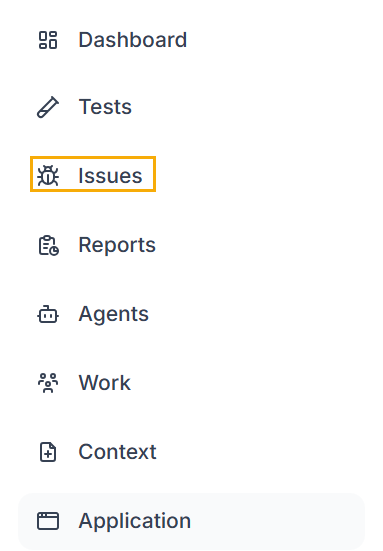
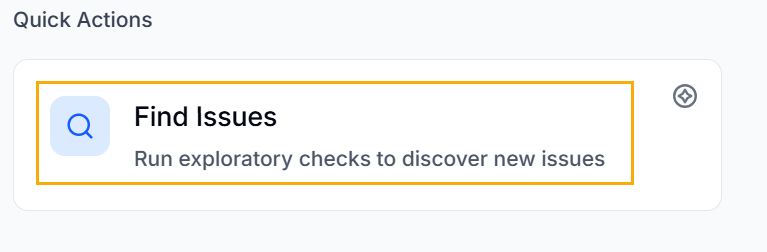
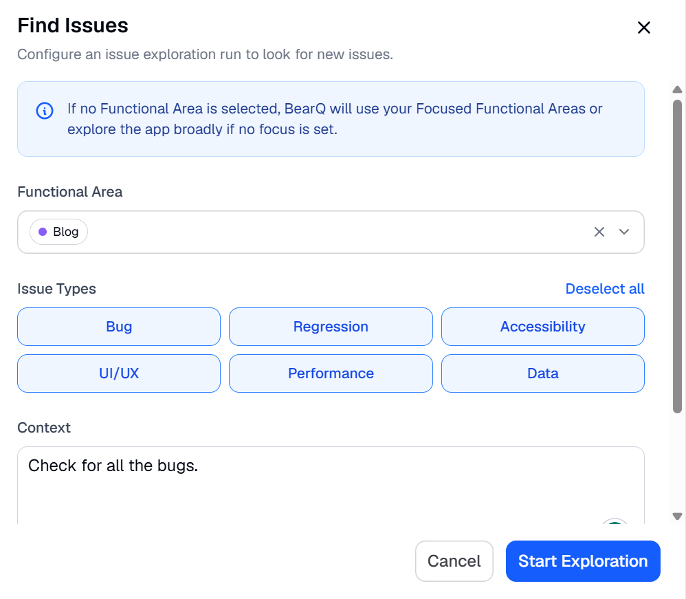
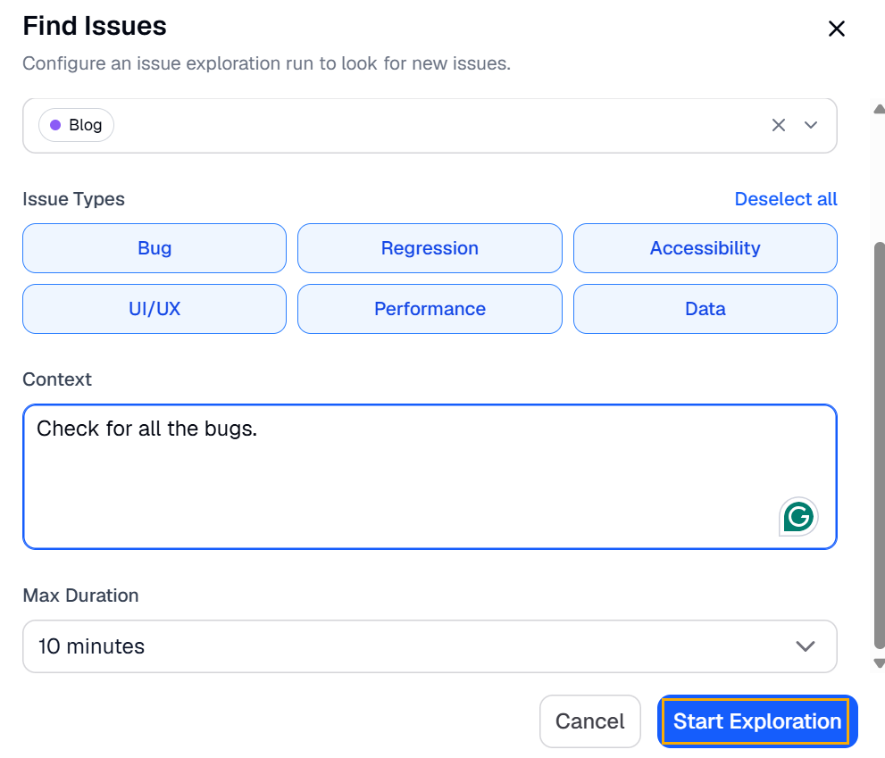
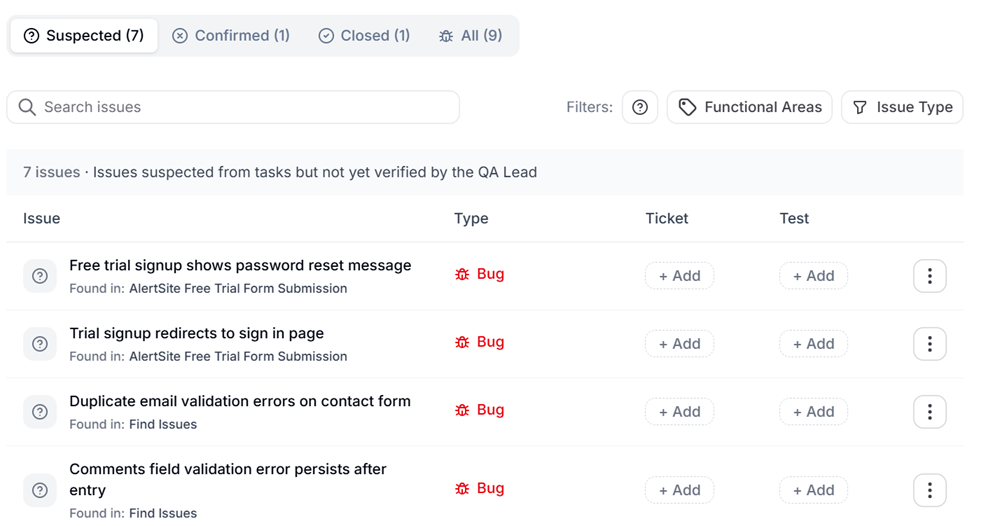
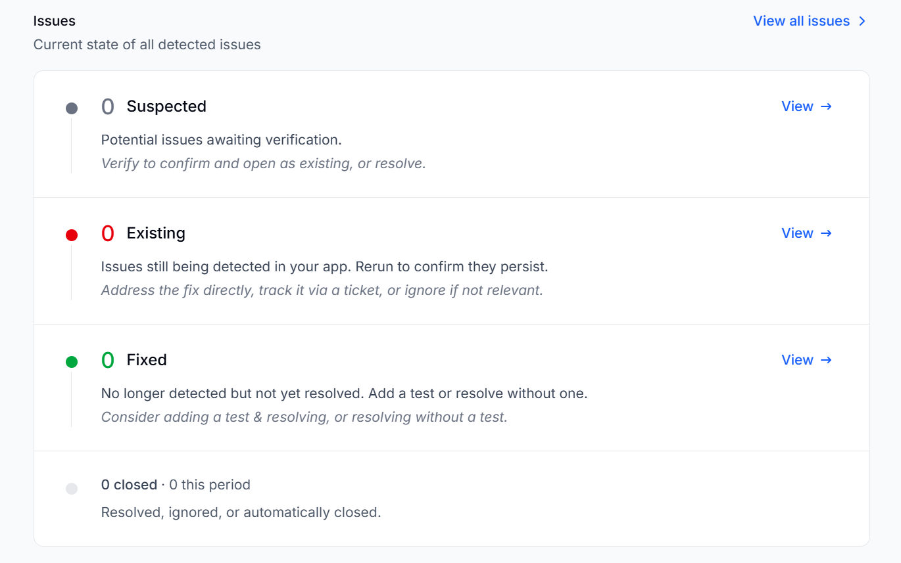

BearQ lets you run a targeted issue scan at any time by configuring the exploration's scope and duration. To find issues, do the following:

1. Log in to BearQ.
2. Click **Issues**.

   
3. Click **Find Issues** under Quick actions.

   
4. Select the Functional Area.
5. Select issue Types you want to find.
6. Add relevant context and select the **Max duration**.

   
7. Click **Start Exploration**.

   

## Viewing the Issues

To view issues that BearQ found while exploring your application, do the following:

1. Click **Issues**.
2. Click on any issue from the given list.

   
3. Review the information displayed for the issue.
4. Click Edit issue to edit the details of the issue.

   
5. Click Verify issue, and BearQ will start verifying the issue.
6. Click Close to either resolve the issue or ignore the issue.

### Issues in the Summary Report

The Summary Report includes a dedicated issues section so stakeholders can see the full state of your application and test results. The issues section shows counts of open, newly detected, and resolved issues for the reporting period. BearQ generates the Summary Report automatically and delivers it to your configured recipients. No additional setup is required to include issue data in the report.

