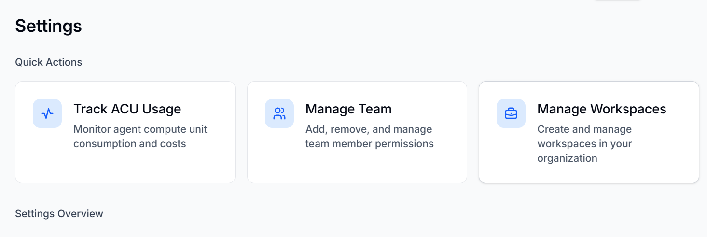

The Settings window allows you to **Track ACU usage, Manage Team, and Manage Workspaces**. The page also displays User settings and Organization settings, which can be changed.

You can manage the settings of the BearQ application by doing the following:

1. Log in to BearQ.
2. Click **Settings**.
3. Click **Track ACU Usage** to view ACU usage. To learn more about ACU usage, read ACU.
4. Click **Manage Team** to add, remove, and manage team members. To learn more about managing team members, read [Managing Team Members](/managing-settings/managing-team/).
5. Click **Manage Workspaces** to create a new workspace or manage the existing ones. To learn more about managing workspaces, read [Managing Workspaces](/managing-settings/managing-workspaces/).

## Settings Overview

**User Settings**

You can change the User Settings. To learn more, see [Managing Team Members](/managing-settings/managing-team/).

**Workspace Settings**

You can change the Workspace settings. To learn more, see [Managing Workspaces](/managing-settings/managing-workspaces/).

**Organization Settings**

You can change the organization name in the organization settings.
