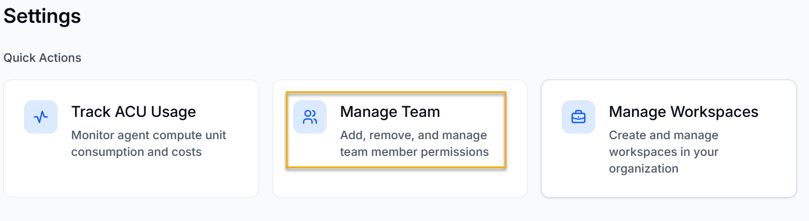
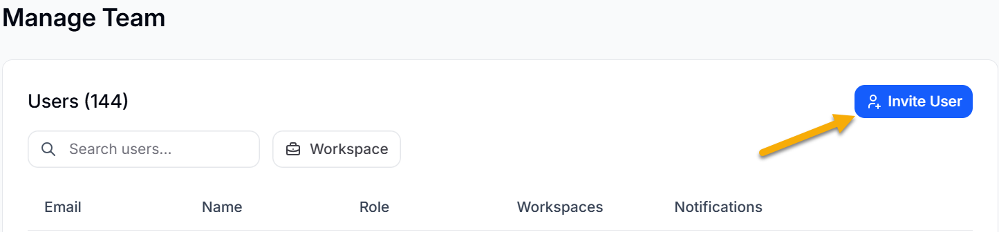
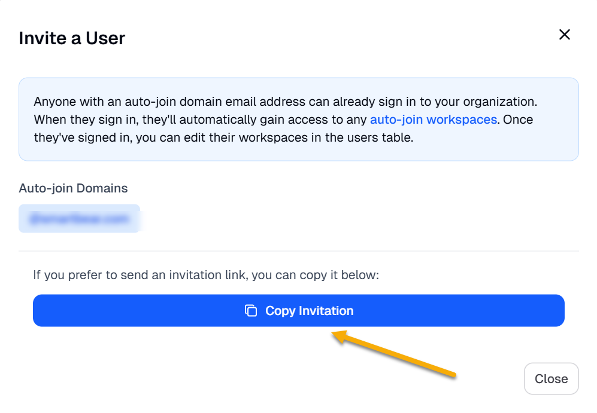
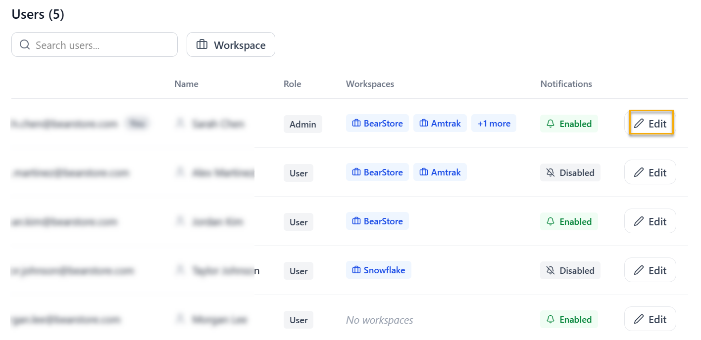
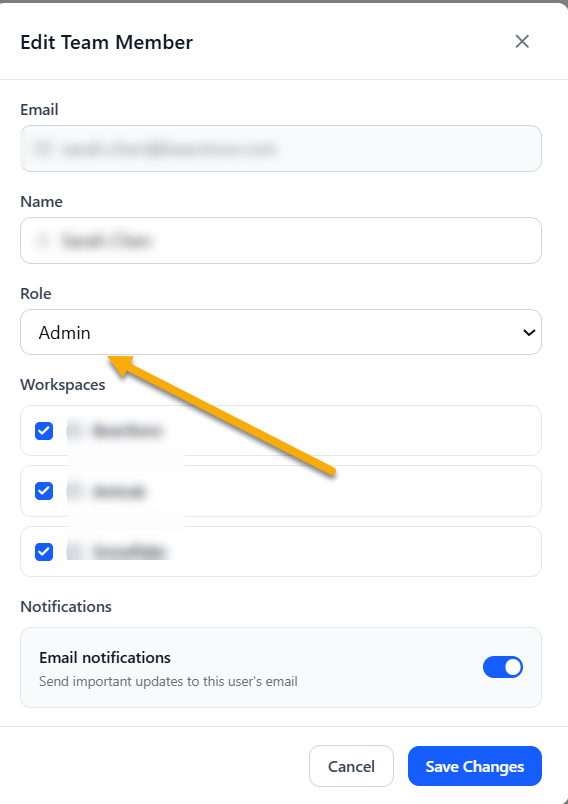
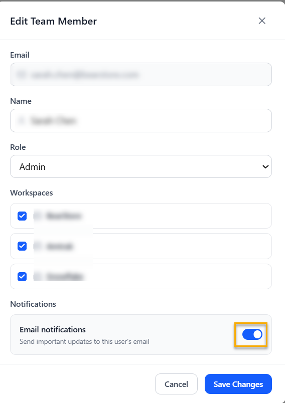

You can manage team members in your workspace by adding, removing, or changing their permissions. This allows you to control the permissions of the members added to your team.

To manage teams, do the following:

1. Log in to BearQ.
2. Click **Settings**.

   
3. Click **Manage Team**.

   
4. Click **Invite User** to invite a particular user to your workspace.

   
5. Click **Copy invitation** if you want to send the invite link directly to the user.

   

## Editing User Permission

To edit the user permission, do the following:

1. Log in to BearQ.
2. Click **Settings**.

   
3. Click **Manage Team**.

   
4. Move to **Users**, and click **Edit**.

   
5. Select the Role you want to give to the user. You can either select **Basic** or **Admin**.

   

   :::note
   Enable **Email notifications** to get important updates about the test in your email.

   
   :::
6. Click **Save Changes**.

The permission for the user will be changed.
