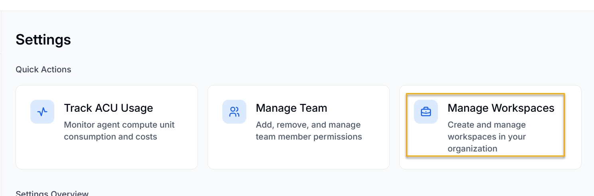
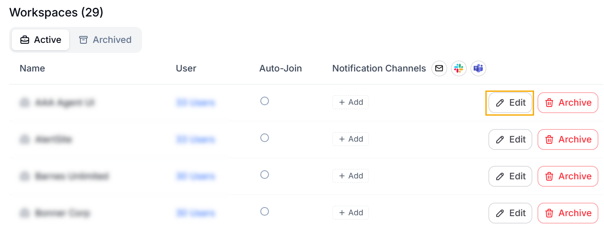
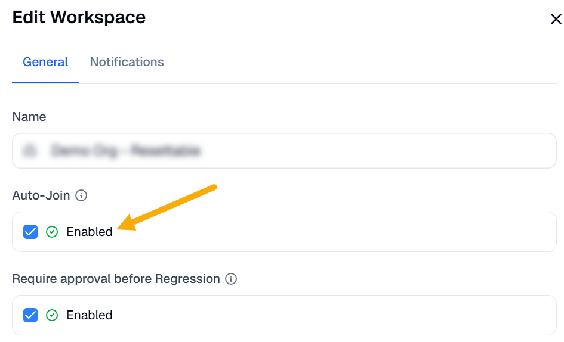
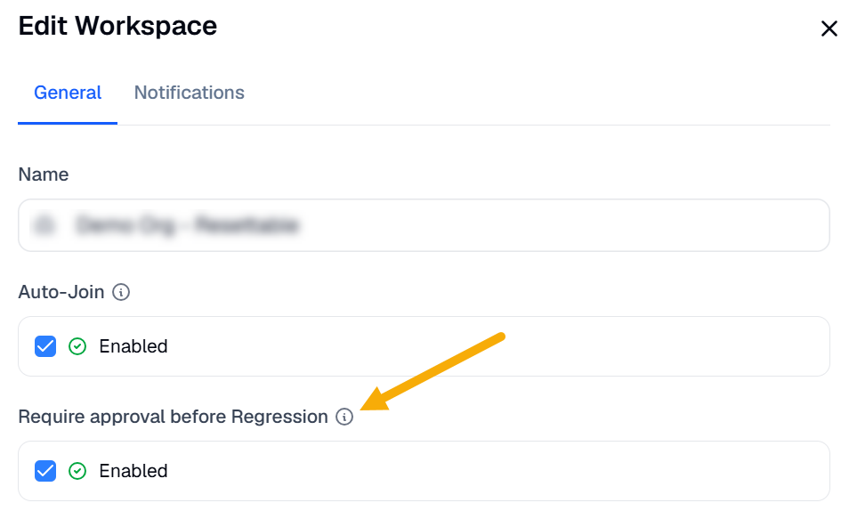
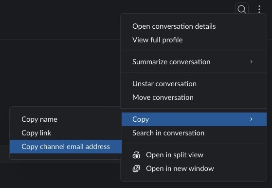
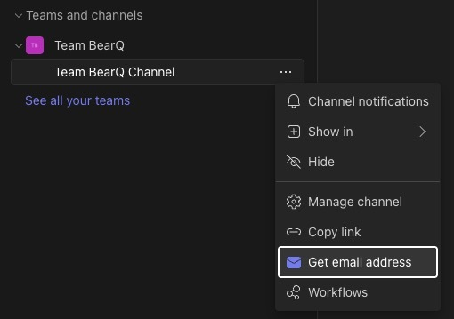

You can manage workspace settings by doing the following:

1. Log in to BearQ.
2. Click **Settings**.

   
3. Click **Manage Workspaces**.

   
4. Click **Create Workspace** to create a new workspace.
5. Enter the name and select whether you want to enable Auto-join. This will allow the user with the selected domain set as the Auto-join domain for the workspace to join the workspace directly upon logging in.
6. Click **Save Changes**.

Your changes will be saved for the workspace.

Similarly, you can edit the workspace. Click **Edit** under workspaces. You can also archive a workspace by clicking **Archive**.

Enter the title and select whether you want to enable Auto-join.

You can also turn on **Require approval before Regression**. When this setting is on, tests that the QA Lead passes require your approval before they are included in the regression tests.

## Sending Updates to Slack or Teams Channels

1. Log in to BearQ.
2. Click **Settings**.
3. Click **Manage Workspace**.
4. Click **Edit** under workspaces.
5. Go to **Notifications**. You can enter the link to the custom Slack or Teams channels where all the alerts will be updated.

   - To get the custom Slack channel email address, Right-click on the channel name and click **copy channel email address**.

     
   - To get the Teams group email address, Right-click on the name of the Teams group and click **Get email address**.

     
6. Click **Save changes**.

Your changes will be saved.
