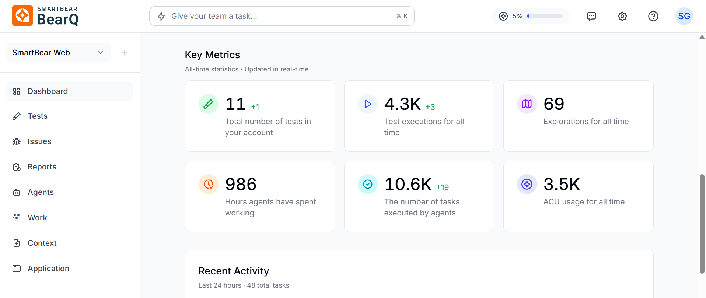

is an AI-native autonomous quality assurance platform. It is designed for modern development teams operating in high-velocity delivery environments. BearQ creates an opportunity to enhance traditional QA approaches by enhancing the quality assurance workflow and expanding test coverage.

provides you with features like autonomous test case generation, daily reports, actionable insights, complete application exploration using the explorer agent, and helps in complete test coverage by scheduling the tests daily and validating the workflows.

The  agents (QA Lead, Tester, Explorer) explore the system, build an [Application Model](/application/application-model/), which is like a living map of the application, including all the elements, pages, and sequences, and validate real-world workflows based on observed behavior by the AI-agent.

**Capabilities**

works on some core capabilities, which are as follows:

- The Explorer agent automatically navigates the application to discover pages, elements, navigation paths, and user workflows without using scripts. As the agent explores,  builds an Application Model that represents the application’s structure, including pages, UI elements, and test coverage. This model helps BearQ create and run tests effectively and helps visualize and expand coverage.
- generates tests from the workflows it discovers and keeps them up to date as the application changes, so users do not have to write or maintain tests manually. It also lets users create tests by simply describing what they want to test, and BearQ automatically generates the required steps.
- When the application changes, such as UI updates or workflow changes,  automatically updates its model and adjusts the tests. This reduces test breakage and lowers the effort needed to maintain tests.
- provides detailed reports, including execution results, trends, coverage insights, and suggested improvements, helping teams understand application quality and how to improve it.

### Application Model

As BearQ explores your application, it builds an Application Model — a structured representation of your application's pages, UI elements, navigation paths, and test coverage. BearQ uses this model to create tests, track changes, and show you where coverage gaps exist.

### Invoke BearQ from other environments

You can trigger BearQ from outside the app using the following integrations:

- BearQ Public API: Use the REST API at api.bearq.smartbear.com to create tasks, run tests, and stream results programmatically. The API is designed for CI/CD pipelines and developer tooling. Each workspace has a unique API key, available in Settings.
- SmartBear MCP Server: BearQ is integrated into the SmartBear MCP server, so any agent or tool that supports the Model Context Protocol (MCP) can drive BearQ directly — including running tests, refining test cases, and chatting with the QA Lead.
- External Agents: You can connect any MCP-compatible external agent to BearQ from the Agents page, including Atlassian Rovo, Jira, and Linear. Once connected, the QA Lead can call on that agent during tasks — for example, creating a bug ticket in Jira when a regression test fails, or pulling in Jira epics to inform exploration.

Watch this intro video to understand more about .

<iframe src="https://fast.wistia.net/embed/iframe/nd3xsy3s31?web_component=true&seo=true" title="Video" style={{border: 0, width: '100%', aspectRatio: '16/9'}} allow="fullscreen" allowfullscreen></iframe>

helps teams move away from manual and script-based testing by automating how they test applications. It lets users explore applications without writing test cases, automatically create and maintain tests, and continuously check important workflows. As the application changes,  updates its tests, reduces maintenance effort, and helps teams find issues early, so they can make their decisions faster and better.
