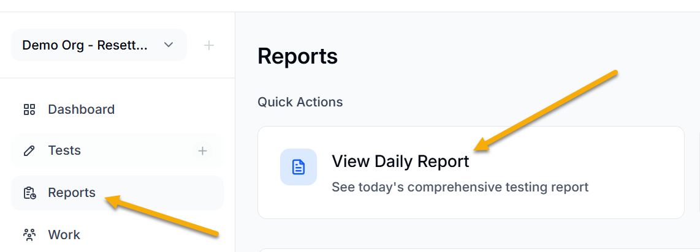
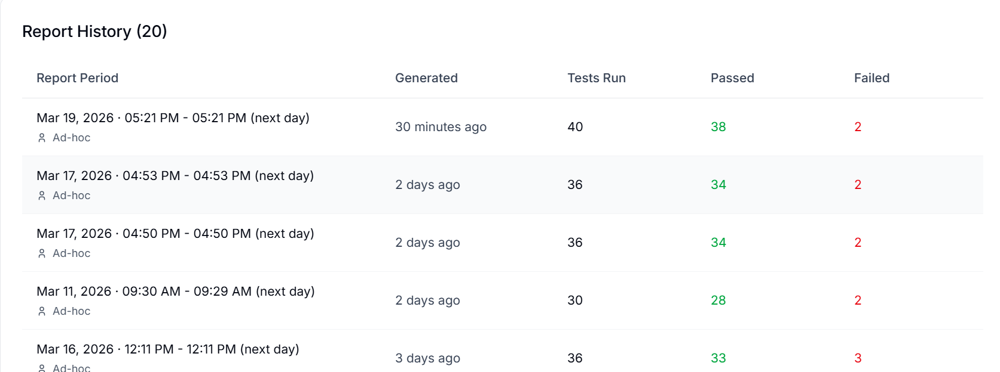

Reports in BearQ show you testing activity, application health, and overall quality trends. They help teams understand how the application performs over time, which tests passed, and what can be improved through suggested actions.

BearQ collects data from its autonomous QA agents during exploration and validation cycles and presents it in a clear and structured way. You do not need to create reports manually. These reports help you quickly answer questions like:

- How many tests were executed? - Watch the results in the **Regression Tests Breakdown** section in the summary report.
- What percentage of tests passed or failed? - Watch the results in the **Regression Tests Breakdown** section in the summary report.
- Where are the recurring issues? - Watch the results in the **Suggested Actions** section in the summary report.
- What went right while testing? - Watch the results in the **What went right** section in the deep research report.

BearQ turns raw testing data into useful insights by analyzing tests over a selected time period. It shows the success rate, highlights recurring issues, and explains how it addresses them. It also suggests actions to improve test execution. By providing continuous visibility through daily reports, BearQ helps teams monitor application health, identify risks early, and resolve critical bugs promptly.

## Viewing Daily Report

To view the daily report, do the following:

1. Log in to the BearQ application.
2. Click **View Report** on the dashboard.

   :::note
   You can also view the daily report by clicking Reports on the dashboard and then clicking **View Daily Report**.

   
   :::
3. There are two sections in the daily report.

   - [Summary](https://support.smartbear.com/bearq/docs/en/reports/summary.html)
   - [Deep Research](https://support.smartbear.com/bearq/docs/en/reports/deep-research.html)

### Report History

The Report window shows the **Report history**, which includes the complete history of reports generated to date in the account. The Report history displays the report period, generation time, number of tests executed, number of tests passed, and number of tests failed.

