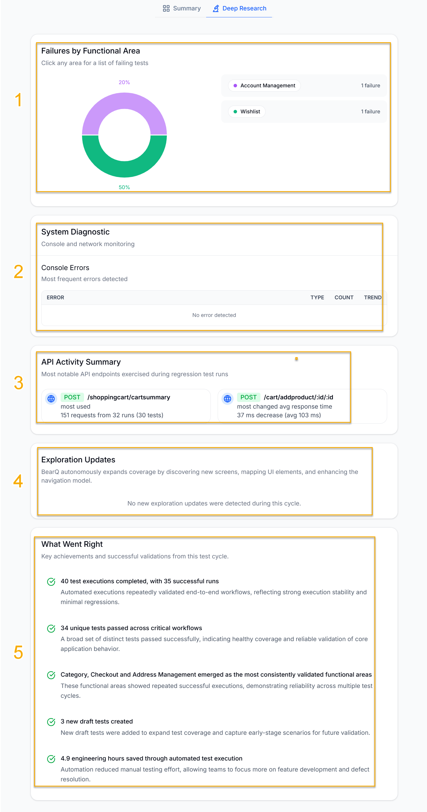

Deep Research provides an in-depth analysis of the report, including failures by functional area, system diagnostics, API activity summary, exploration updates, and what went right during testing.

1. **Failures by Functional Areas**: Displays the percentage of failures by functional areas.
2. **System Diagnostic**: Displays the most frequent network or console errors.
3. **API Activity Summary**: Displays the most notable API endpoints used during the test runs.
4. **Exploration Updates**: Displays updates on the application's exploration. BearQ automatically expands test coverage by discovering new screens, identifying UI elements, and improving the application model.
5. **What Went Right**: Displays the key achievements and successful validations from this test cycle. It shows the number of tests passed, the number of engineering hours saved through automation testing, and the top functional areas in the testing cycle.
