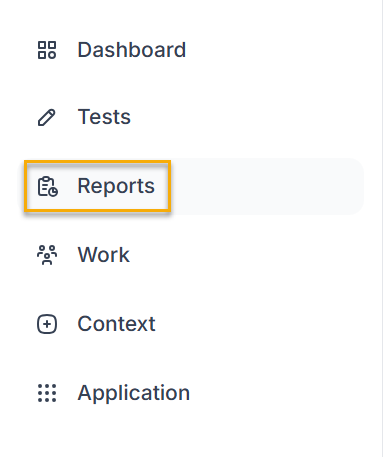
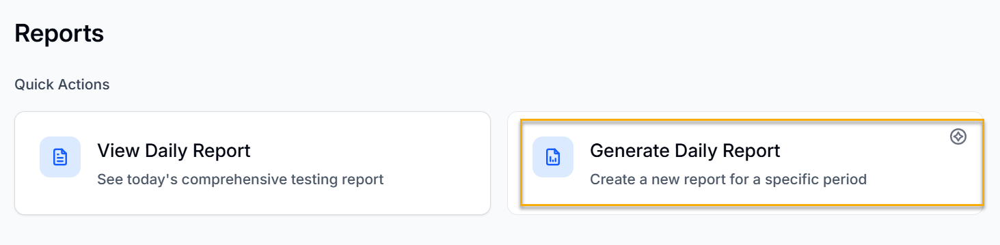
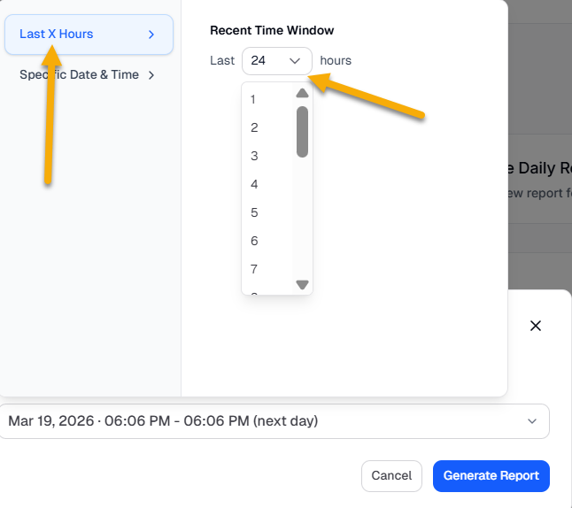
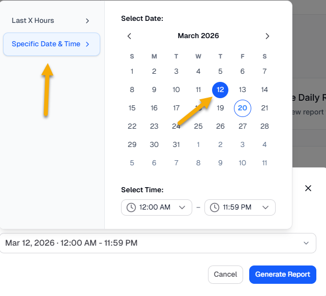
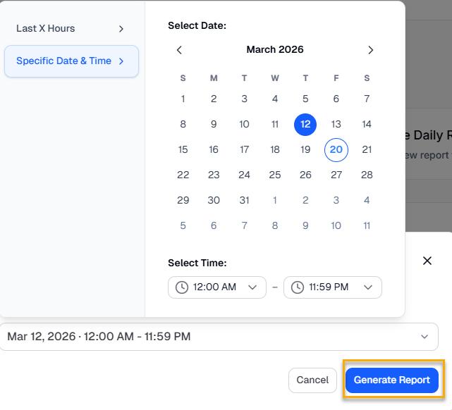

To generate a report for a specified time, do the following:

1. Log in to the BearQ application.
2. Click **Reports**.

   
3. Click **Generate Daily Report**.

   
4. Select the time range for the report.

   - You can either select the time range in the recent time window. Click **Last X Hours** and choose the time from 1 to 24 hours.

     
   - Click **Specific Date & Time** and choose the specific date and time for which you want to generate your report.

     
5. Click **Generate Report**.

   

Your report will be generated.
