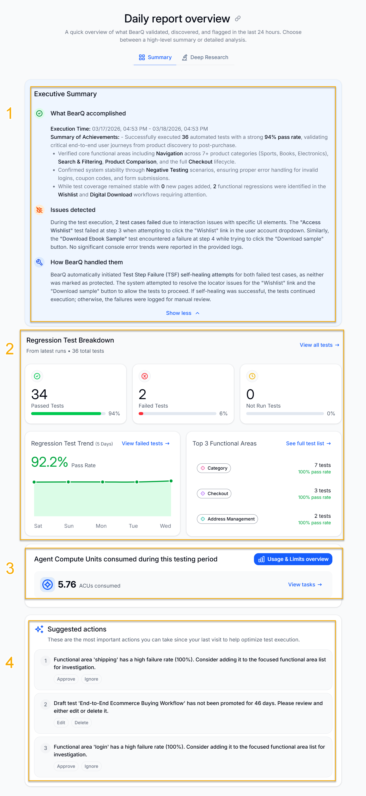

The summary section of the report contains various key insights, such as Executive Summary, Regression Test Breakdown, Suggested Actions, and ACU usage.

1. **Executive Summary**: Contains the executive summary of the whole report generated by BearQ. This includes what BearQ accomplished in the time span, along with a summary of achievements, issues detected while testing, and how BearQ handled all the issues. This is the analytics of the complete report, written in plain language for the user to understand easily.
2. **Regression Test Breakdown**: Shows the complete breakdown of the regression tests that were executed in the time span. This shows the total number of passed, failed, and not run tests. You can also see these tests when you click on the insights. To view all regression tests, click **View all tests**.
3. **Regression Test Trend**: Displays the trends for regression tests, showing the test success rate over the past 5 days. Click **View failed tests** to see the tests that have failed during execution.
4. **Top 3 Functional Areas**: Displays the top 3 functional areas in all the tests executed while testing. Click **See full test list** to see the list of all tests executed with the top 3 functional areas.
5. **Agent Compute Unit (ACU) usage**: Displays the ACU usage of the total tasks executed in the time span of the report. Click **Usage and Limits Overview** to view the overall ACU usage for the account to date. Click **View tasks** to view the ACU usage for a specific task.
6. **Suggested Actions**: Displays the most important actions you can take since your last visit, to help optimize test execution. You can either Approve or Ignore the suggestions. Based on your selection, BearQ will automatically perform the suggested action.
