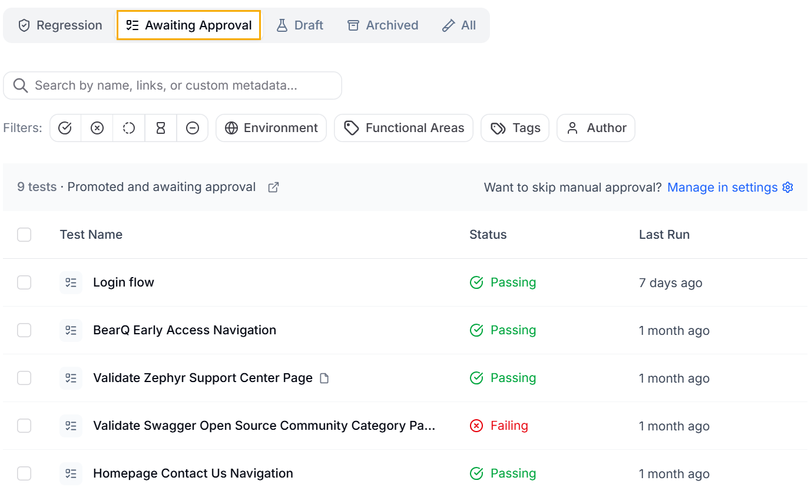
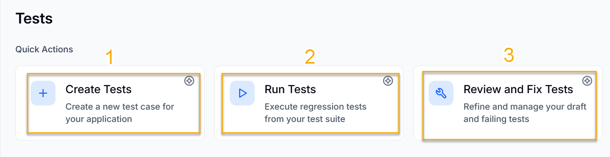
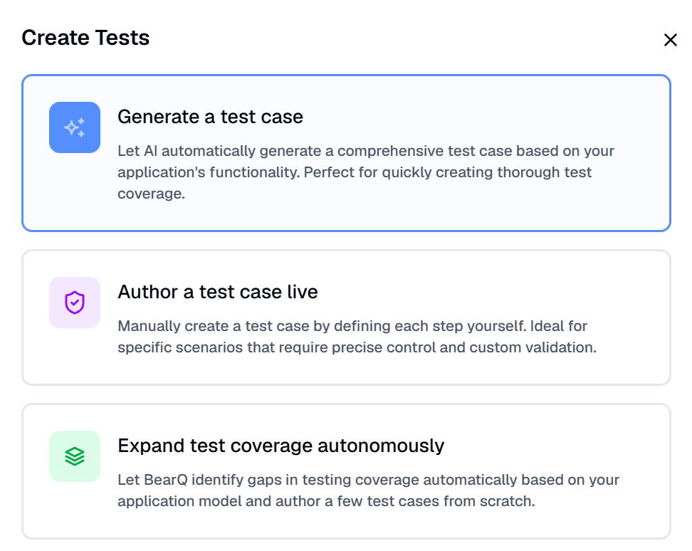
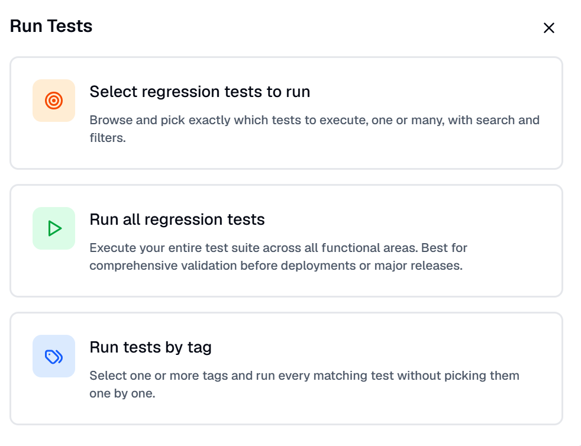
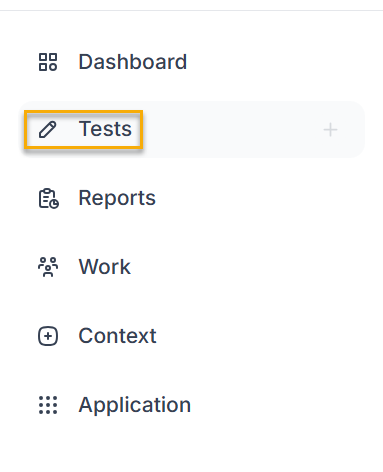
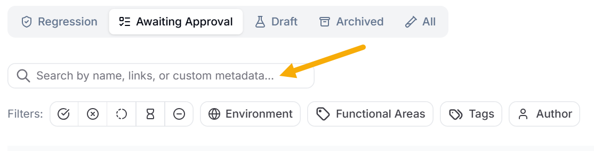
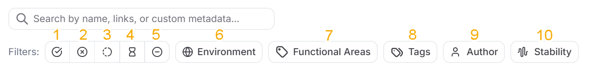

The Tests window allows you to **Create Tests**, **Run Tests**, and **Review and Fix Tests**. It also displays all the **Regression Tests**, **Draft Tests**, and **Archived Tests**.

## Types Of Tests

**Regression Tests**

Regression testing verifies that existing functionality continues to operate correctly after changes are made to the application. These changes may include:

- New feature additions
- Bug fixes
- Code updates or enhancements
- Configuration changes
- Performance improvements

**Draft Tests**

Draft tests are test cases that have been created but are not yet finalized or formally approved for execution. They are typically in a preliminary state and may still require updates or review. Draft tests usually indicate that:

- The test case is newly created
- Steps, expected results, or test data may need refinement
- The test has not yet been reviewed or approved
- Once these draft tests are refined and fixed, they can be promoted to regression tests in BearQ.

**Archived Tests**

Archived tests are test cases that are not actively used by agents and remain in the system for reference. These can be restored to the Draft tests by clicking **Restore**.

**Tests Awaiting Approval**

These tests are awaiting your approval before they become regression tests. To skip the manual approval process, change your [Settings](/managing-settings/).

You can browse all test types by selecting the appropriate tabs, as shown in the following image.

## Quick Actions

There are three Quick actions available: Create Tests, Run Tests, and Review and Fix Tests.

1. **Create Tests**: Clicking Create Tests will navigate you to a window where you can create AI-generated test cases, author a test case live, or expand test coverage autonomously. To learn more about creating tests, read **[Creating Tests](/tests/creating-tests/)**.

   
2. **Run Tests**: Opens a modal where you can run a particular regression test, run all the regression tests created in the account, or run tests by tag. To learn more about running a test, read **[Running Tests](/tests/running-tests/)**.

   
3. **Review and Fix Tests:** Opens a modal where you can either Refine all draft tests to automatically improve test quality for subsequent tests or Review draft failing tests, which lets you review all drafts and failing test cases. To learn more about reviewing and fixing tests, read **[Reviewing and Fixing Tests](/tests/reviewing-and-fixing-tests/)**.

### Searching and Filtering Tests

To Search tests, do the following:

1. Log in to BearQ.
2. Click **Tests**.

   
3. Move to **Search Tests** and enter the name, link, or custom metadata of the test you want to search.

   

To Filter tests, do the following:

1. Log in to BearQ.
2. Click **Tests**.

   
3. Move to **Filters**. You can see 10 different filter types.

   

1. **Based on passing tests:** The tests are filtered to show only passing tests.
2. **Based on failing tests:** The tests are filtered to show only failing tests.
3. **Based on running tests:** The tests are filtered to include only those that are running.
4. **Based on refined tests:** The tests are filtered to include only those that are refined.
5. **Based on Not-run tests:** The tests are filtered to include only tests that are not run.
6. **Based on Environment:** The tests are filtered by the selected environments.
7. **Based on Functional Areas:** Tests are filtered by functional area.
8. **Based on Tags:** Tests are filtered by tags.
9. **Based on the author:** The tests are filtered by the author who created them.
10. **Based on Stability**: The tests are filtered by stability, whether they are flaky or stable.

You can easily filter your tests based on these filters.

## Autonomous Test Flow

The workflow from draft test to regression test follows a structured progression:

1. Create a draft test by adding a name and description that define the objective.
2. Refine the test by adding and updating steps to match the intended outcome.
3. Validate that the steps fully achieve the objective described in the test.
4. Promote the test to a regression test if it proves useful and reliable.

This approach ensures that only high-quality, well-defined tests are included in the regression suite, improving overall test coverage and maintainability. To learn more about test status in the test flow, see [Test Status](/tests/test-status/).
