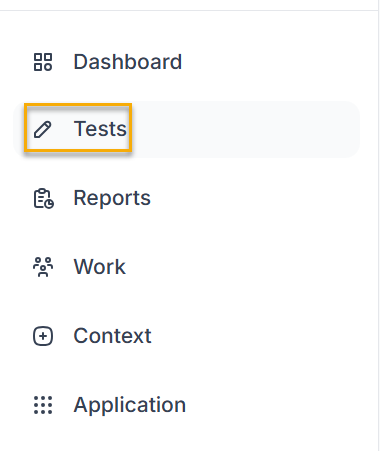
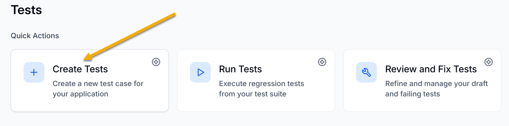
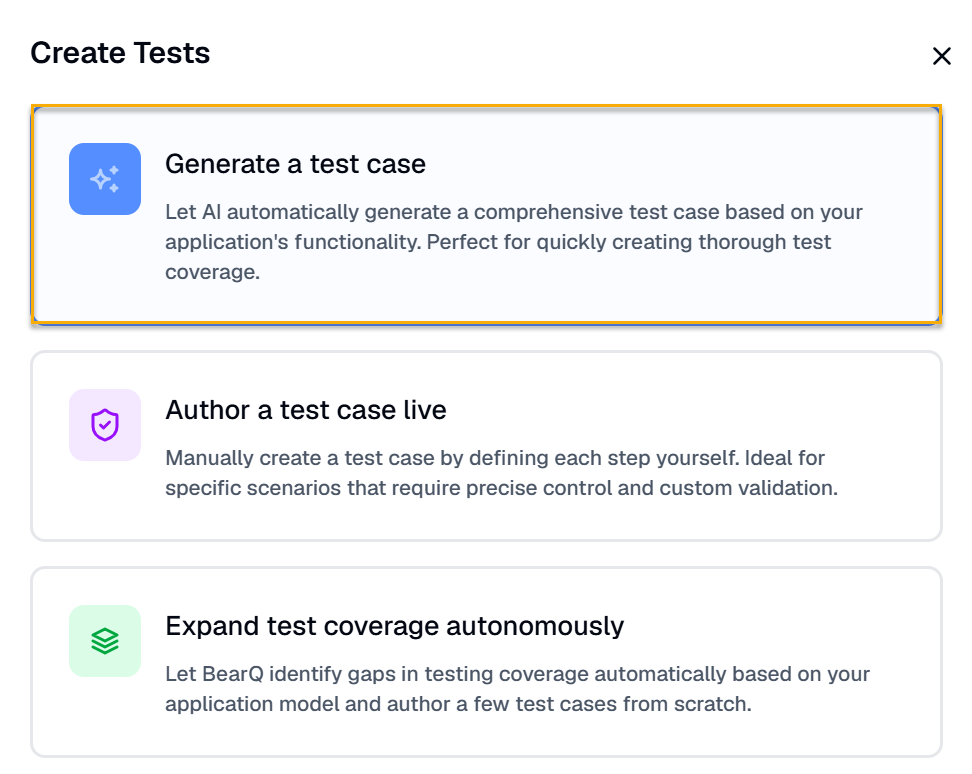
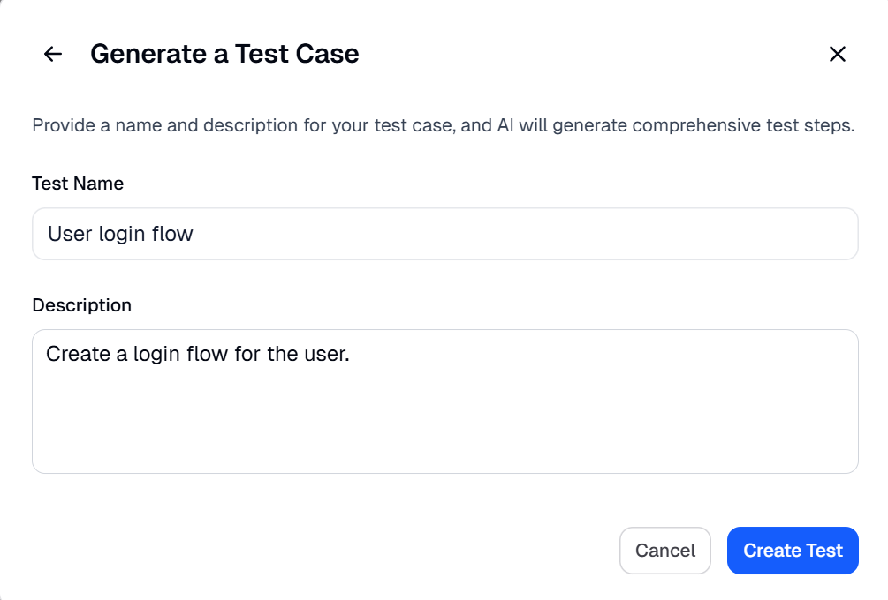
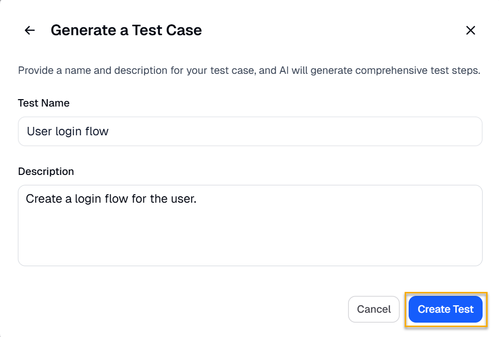
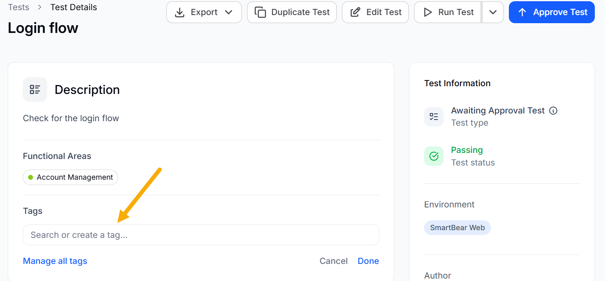
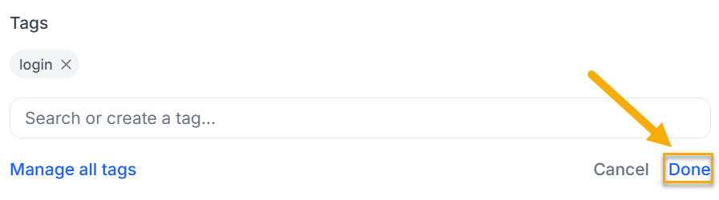
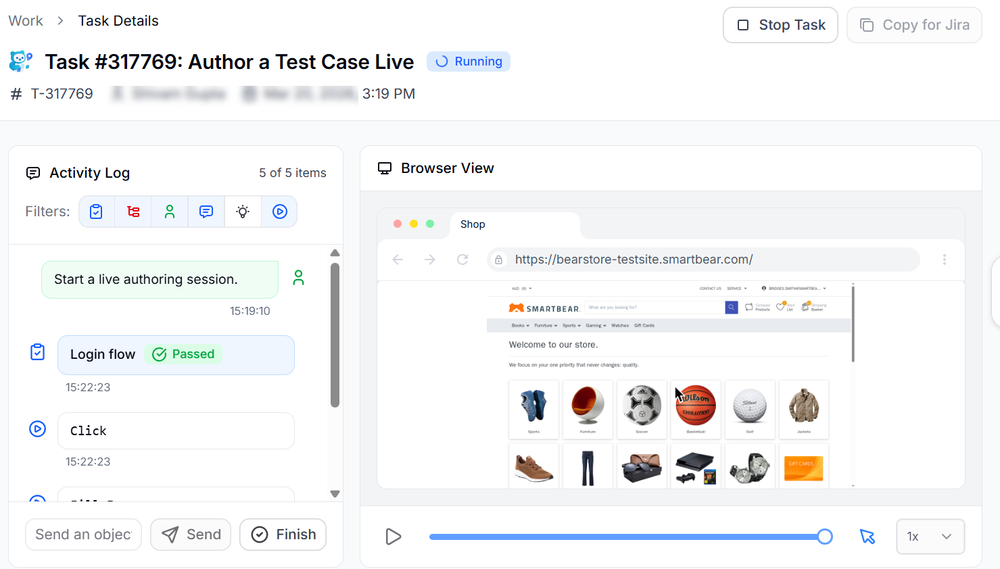

automatically discovers, tests, and reports on your application without requiring your input. You can still create tests manually if needed.

To create a test in , do the following:

1. Log in to the  application.
2. Click Tests.

   
3. Click **Create Tests** under Quick Actions.

   
4. Click **Generate a test case** if you want to create AI-generated test cases.

   

   1. Enter the Test name and Description.

      
   2. Click **Create Test**.

      

   The test goes through an initial refinement session right after creation.  then continues to refine and improve the test over time. It repeats this process until the test is ready to be move to regression testing. At the end,  generates the final test case with the required steps created by AI.

   You can also add tags to tests, which can be used to filter tests by a particular tag.

   

   To add a tag, select a predefined tag or create a new one. Click **Done** to save the tag.

   
5. Click **Author a test case live** to create a test case in real time. Enter the steps in the **Activity log**, and BearQ will execute them as you add them. For example, if you enter steps for a login flow,  will run them and automatically create the test case. You can also enter your own custom steps as messages, and BearQ will execute them and show the results in the browser window.

   
6. Click **Expand test coverage autonomously** to automatically identify gaps in test coverage based on your application model. The QA Lead agent starts expanding the coverage of the application.

This is how you can easily create test cases in the  application.
