There are multiple ways to edit a test. Choose the option that best suits your use case.

- To instruct the QA Lead to make broad changes across multiple steps based on the current test description, select **Edit with a prompt**.
- If the test requirements have changed, select **Change requirements**.  removes the previous steps, moves the test to drafts, and generates new test steps based on the updated description.
- If the requirements are clear and you want the QA Lead Agent and Tester Agent to continue refining the test steps, select **Refine test steps**.
- If you know exactly what needs to change in one or more steps, select **Edit details manually**. You can then add, remove, or update steps precisely.
- If the test is no longer relevant, select **Delete test** to move it to the archive.

You can edit a test easily by doing the following:

1. Log in to .
2. Click **Tests**.
3. Select any of the tests.

   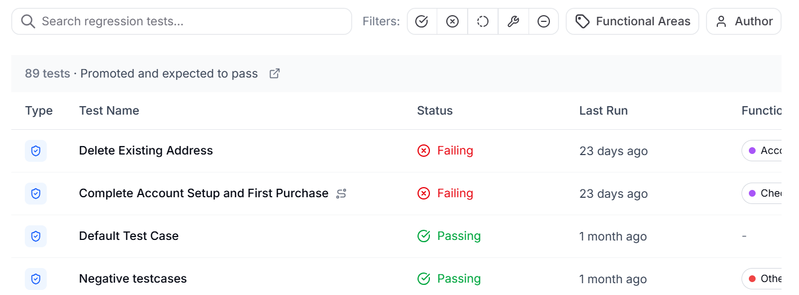
4. Click **Edit Test**.

   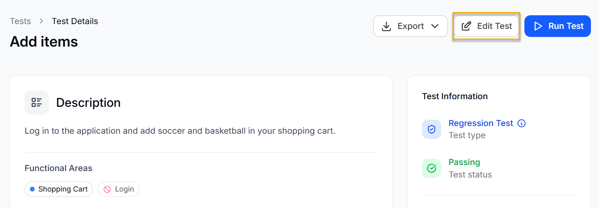
5. Enter a prompt to make the required modification in the test.
6. Click **Send Instructions**.

   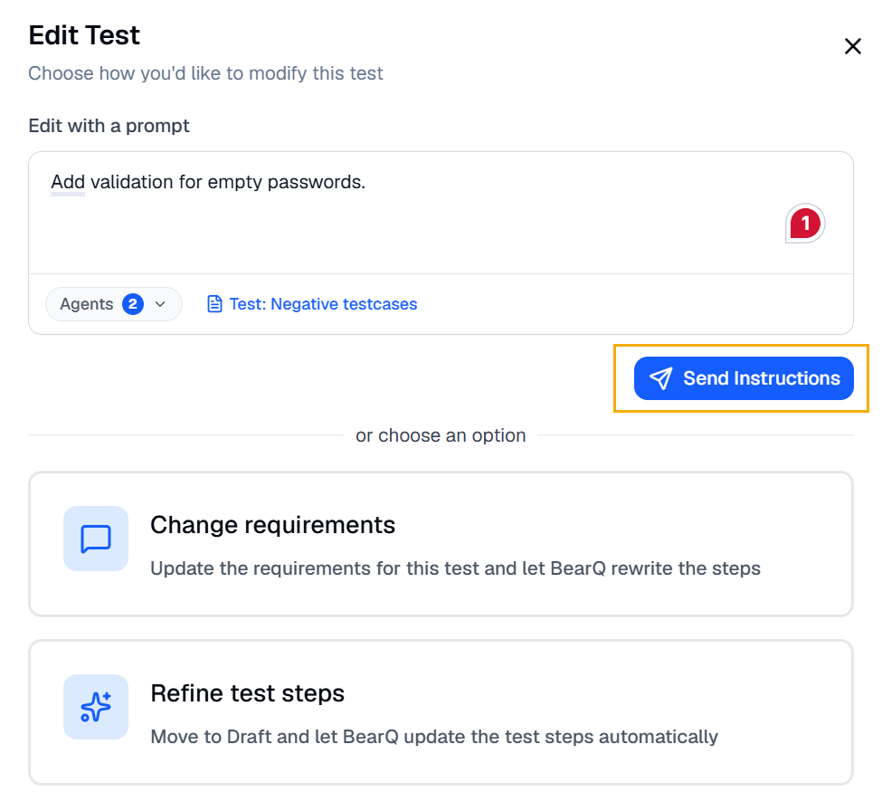

## Changing Test Requirements

To change the requirements of a test, do the following:

1. Select any of the tests.
2. Click **Edit Test**.
3. Click **Change requirements**.

   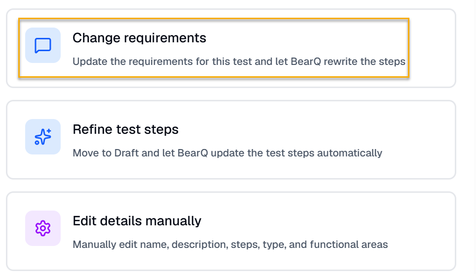
4. Enter the new test name and description.
5. Click **Save and Rewrite steps**. BearQ will automatically rewrite the test steps.

   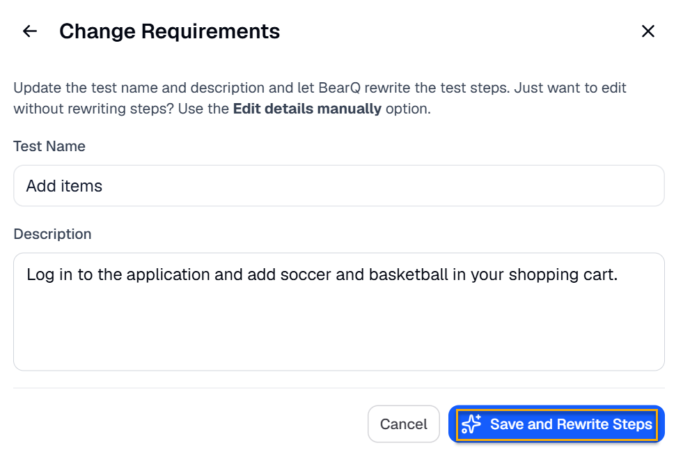

## Adding Custom Fields in a Test

To add custom fields in a test, do the following:

1. Log in to BearQ.
2. Select any of the tests.
3. Go to **Test Information**.

   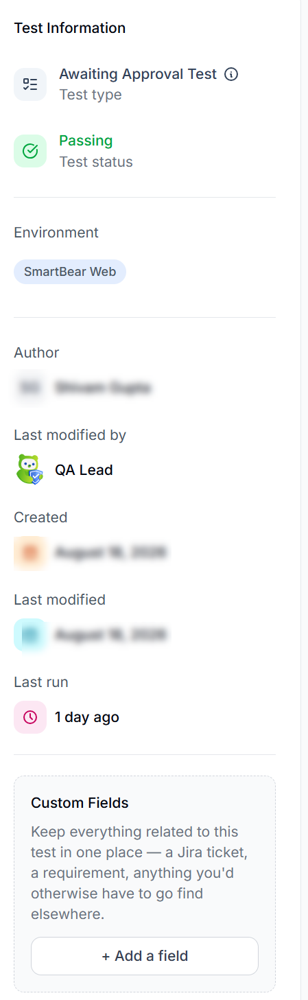
4. Select **Add a Field** in Custom Fields.

   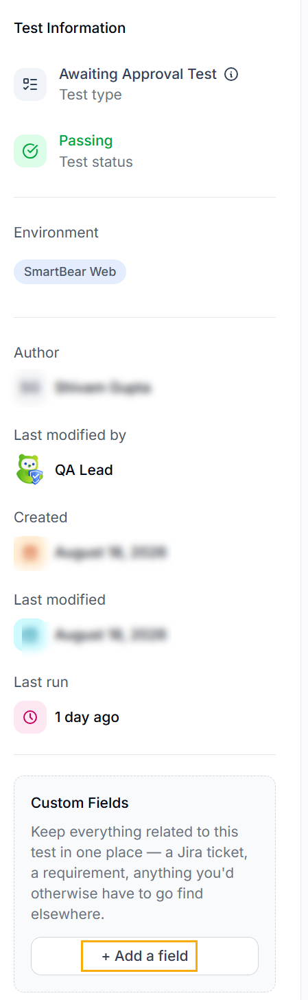
5. You can add any custom details such as Jira tickets, requirements, etc. Enter the Field name and value, and click **Add Field**.

   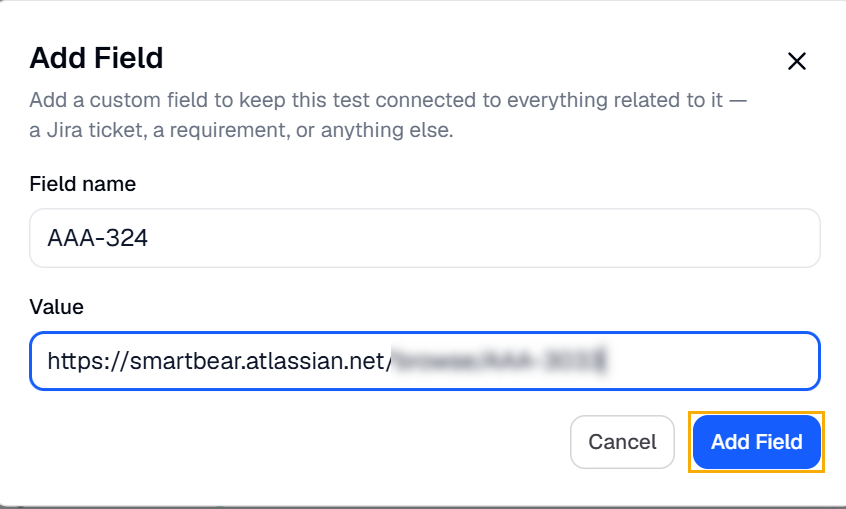

### Manually Editing the Test

You can manually edit a test in BearQ to adjust its details or its steps. Manual editing is useful when you want to refine what BearQ authored, correct a step, or add information that the agent could not infer on its own. You can edit the steps manually by doing the following:

1. Click **Tests**.
2. Select any test from the test window.

   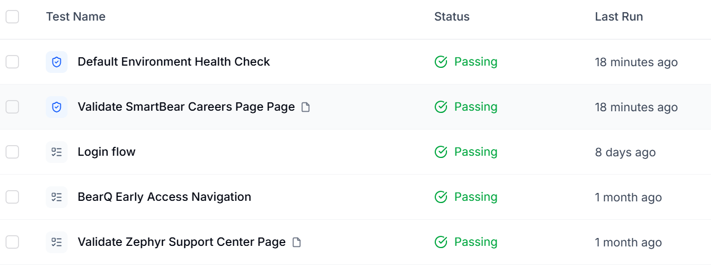
3. Click **Edit Test**.

   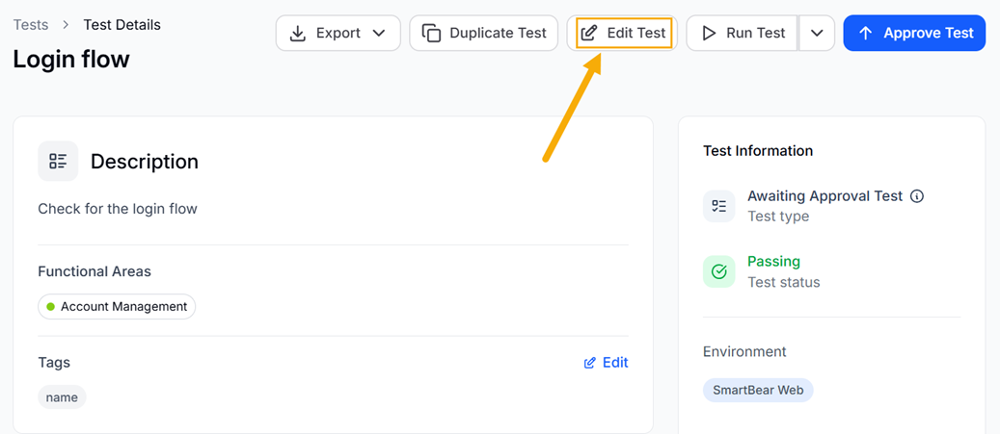
4. Click **Edit Details manually**.

   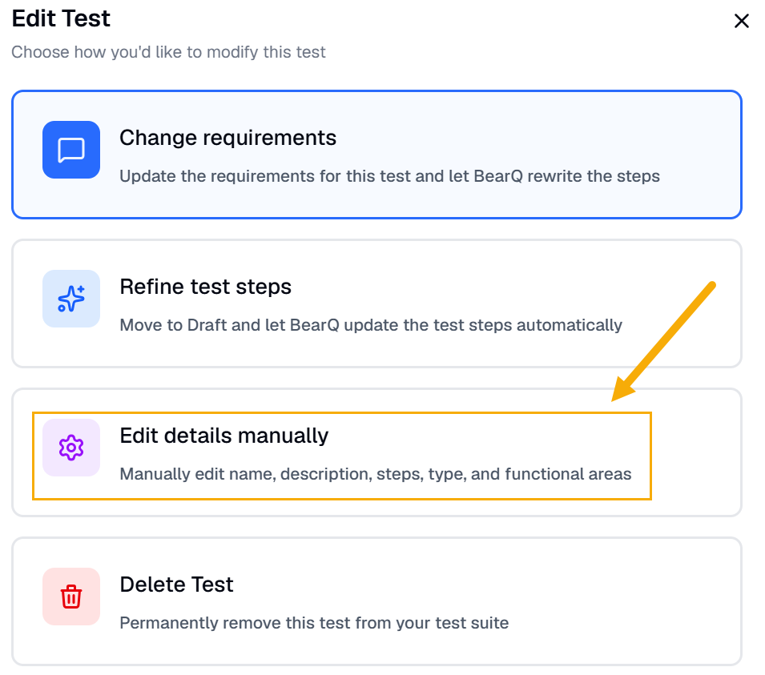
5. Select **Steps**.

   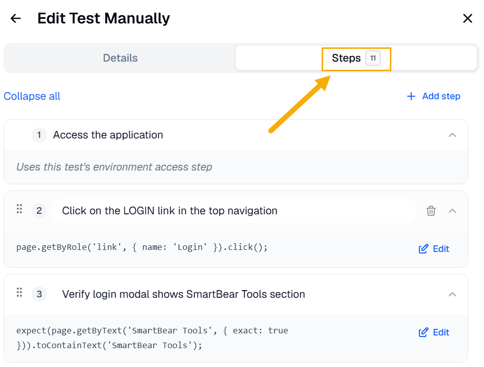
6. Click **Edit** on the steps you want to edit. It will open the code and you can make changes in the code of the steps. You can also change the step's text directly, which will automatically cause any associated code to be regenerated the next time the test runs.

   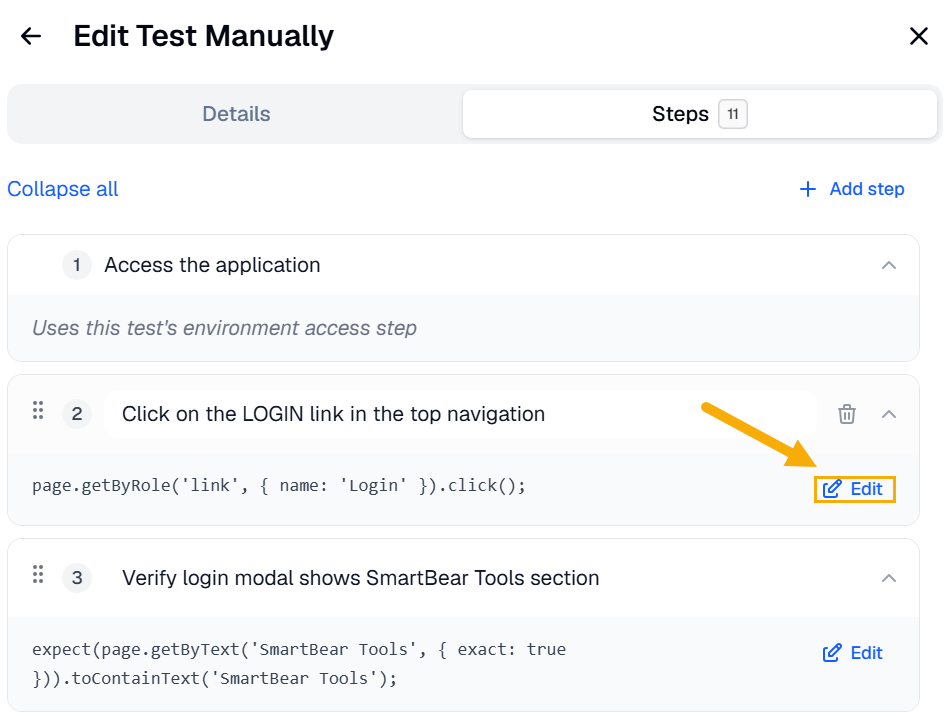
7. After making the changes in the code, click **Save Changes**.

#### View the Step Code

You can view the underlying code for a test's steps. In the step editor, switch to the code view to see each step represented as structured JSON. The code view shows exactly how each step is defined, which is helpful when you want to understand or copy a step's structure.
