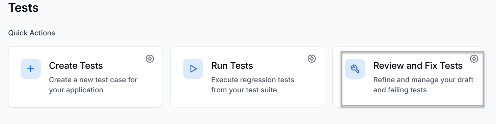
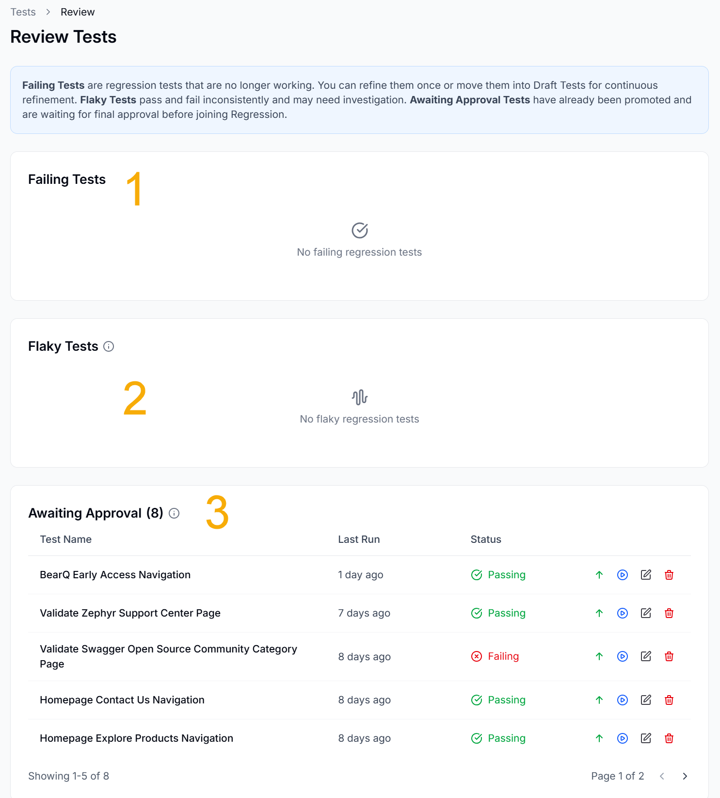
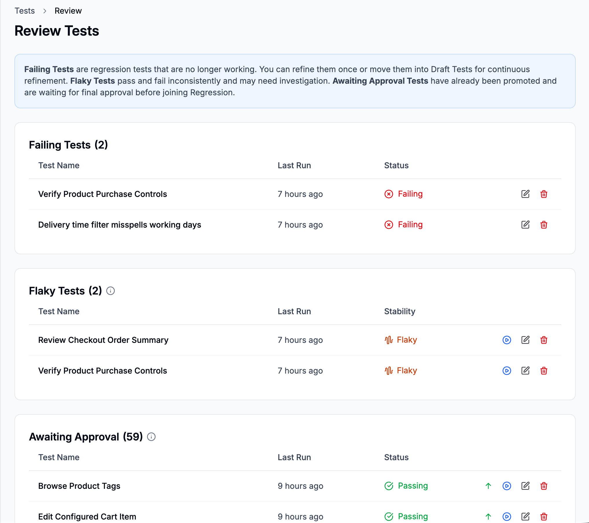

You can refine any test in BearQ at any time. When you refine a test, BearQ checks whether it is correct and complete based on its name and description.

During refinement, BearQ updates the test to improve its performance. It may add missing steps, remove unnecessary steps, or improve how steps are written. For draft tests, BearQ usually adds missing steps to complete the test. For regression tests, it may fix steps that no longer work, even if the application has not changed.

To review and fix tests in BearQ, do the following:

1. Log in to the BearQ application.
2. Click **Tests**.

   
3. Click **Review and Fix Tests** under Quick Actions.

   
4. There are three types of tests in BearQ, which are shown in the image.

   

   1. **Failing Tests:** Failing Tests are regression tests that are no longer working. You can refine them once or move them into Draft Tests for continuous refinement.

   2. **Flaky Tests:** Flaky Tests pass and fail inconsistently and may need investigation.

   3. **Awaiting Approval Tests:** Awaiting Approval Tests have already been promoted and are waiting for final approval before joining Regression.

   
5. You have different options in all types of tests. The various options in the Awaiting Approval test types are as follows:

   

1. **Approve and promote to regression:** Click this button to approve the test and promote the test to a regression test.
2. **Run Test:** Click this button to run the test.
3. **Edit Test:** Click this button to edit the test details and requirements.
4. **Delete Test:** Click this button to delete the test.
