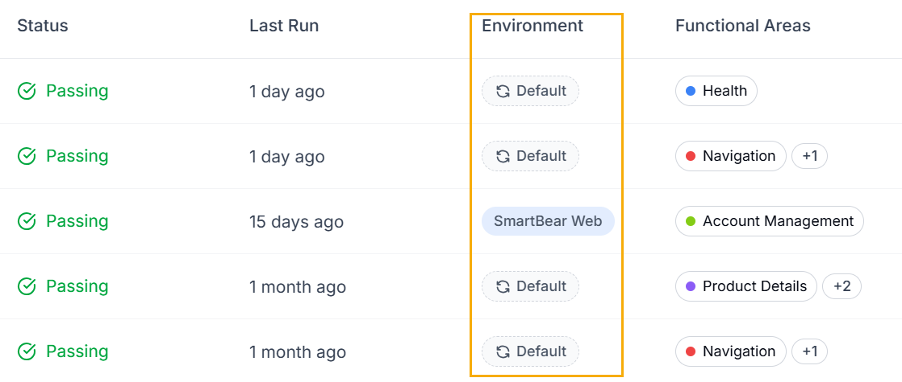
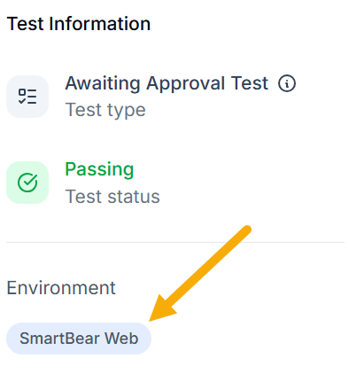

Every test in  is associated with an environment. By default, a test runs in its associated environment. You can see the association, and you can override it for a single run.

When you create a test,  associates it with the environment used at that time. This is the environment the test runs in, unless you override it for a specific run.

You can see a test's environment in two places:

- In the Environment column of the tests list

  
- In the sidebar of the test details

  

## Default Environment

You can set a test's environment to Default rather than a specific one. A test set to Default runs in whichever environment is the current default at the time of the run. If you change the workspace default later, the test follows the new default.

**Why associate a test with a specific environment?**

Associating a test with a specific environment is useful when that environment has characteristics the test depends on. For example, an environment might sign in using a user ID with a specific role. The test can then access functionality that other users cannot. Keeping the test tied to that environment makes sure it runs with the right access each time.

## Override the environment for a single run

When you run a test, you can override its environment for that run only. The override applies to that single run and does not change the test's associated environment. For example, a test might be set to run in the default environment. You can override it to run in production instead to see whether it passes there.

You can override the environment in several ways:

- From the dropdown on the Run Test button
- When chatting with the QA Lead
- Through the public Application Programming Interface (API)
- Through the SmartBear Model Context Protocol (MCP) server
