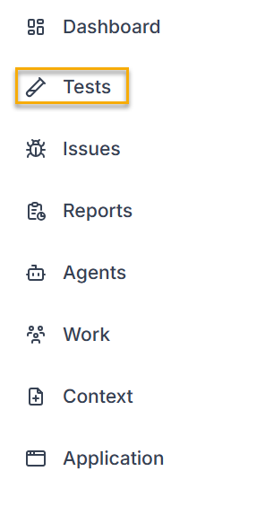
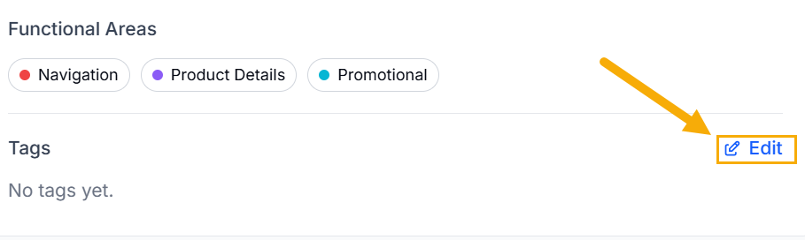
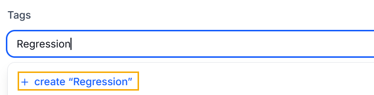
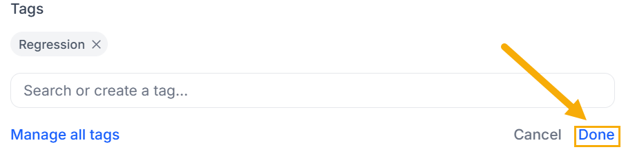
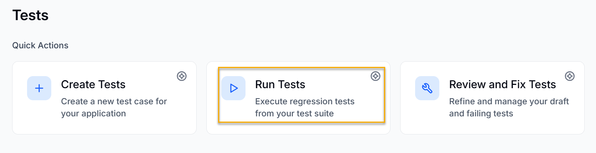
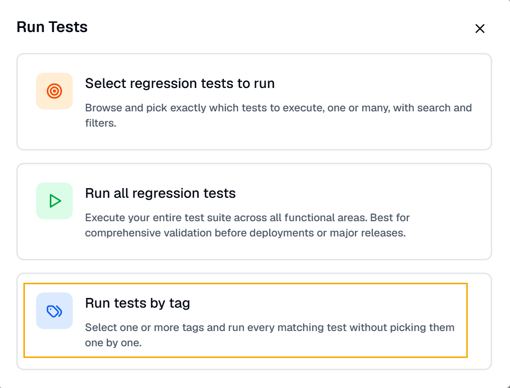

Tags let you group related tests and act on them together. You can apply your own tags to tests, filter the test list by tag, and run every test that carries a tag. Tags are a flexible way to organize your tests, for example, by feature area, priority, or labels such as "smoke" or "regression".

This organization matters as your test suite grows. Tags let you target the right set of tests for a run without listing each test by hand.

## Tagging a Test

You can add one or more tests to the test by doing the following:

1. Log in to BearQ.
2. Click Tests.

   
3. Select any of the tests where you want to add the tag.
4. In the test details, click **Edit** under Tags.

   
5. Add the tag you want. Click the plus sign.

   
6. Click **Done**.

   

### Filter Tests by Tag

To learn about filtering tests by tag, read [Filtering Tests](/tests/).

### Running Tests by Tag

To run a test by tag, do the following:

1. Log in to BearQ.
2. Click **Tests**.
3. Click **Run Tests** under Quick Actions.

   
4. Click **Run tests by tag**.

   
5. Select the tags you want to run. A list will appear, showing all tests associated with each tag.
6. Click **Run Tests**.
