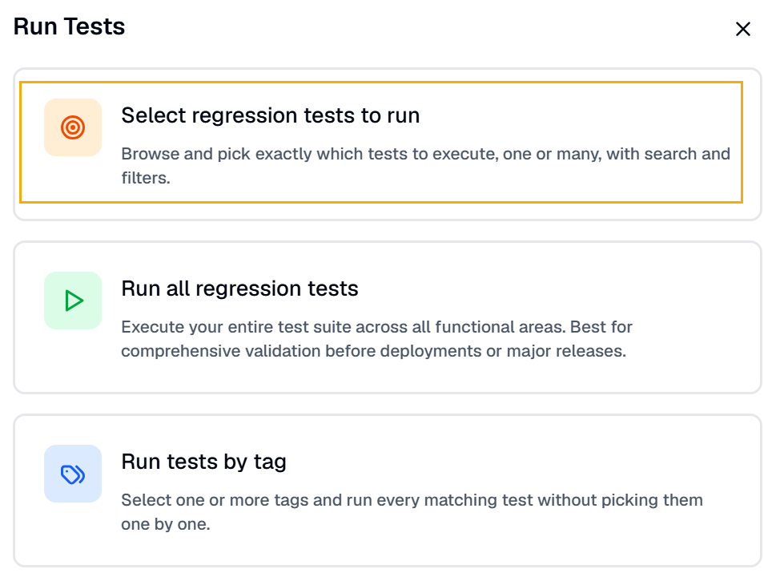
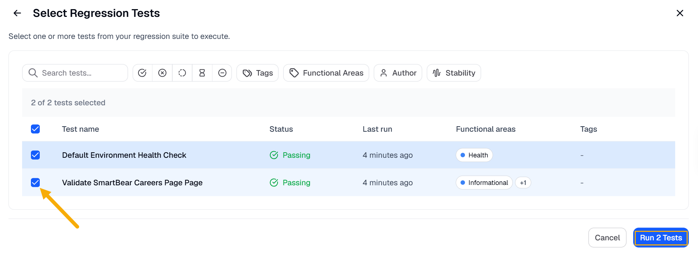
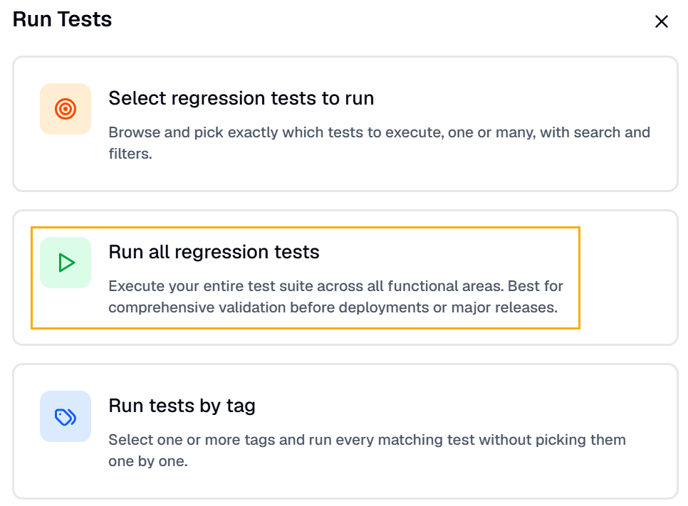
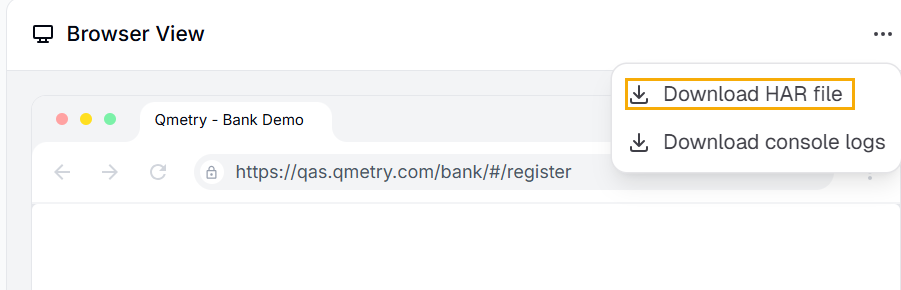
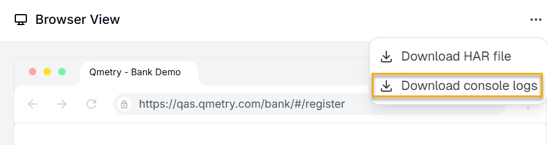

You can run any test in BearQ at any time. When you run a test, BearQ executes each step in order and verifies that each completes successfully. If any step fails, the test fails. BearQ can make small adjustments to fix minor issues using self-healing, but if it cannot complete a step, it marks the step and the test as failed. After each run, BearQ shows the result as either passed or failed.

To run tests in BearQ, do the following:

1. Log in to the BearQ application.
2. Click Tests.

   
3. Click **Run Tests** under Quick Actions.

   
4. Click **Select regression tests to run** if you want to run multiple regression tests.

   

   1. Select any one of the given Regression tests or multiple tests. Click **Run Test**. All the tests will be queued.

      
5. Click **Run all Regression tests** if you want to execute all the regression tests created in the account.

   
6. Click **Run tests by tag** to run tests associated with a specific tag.

   

This is how you can easily run tests in the BearQ application.

## Download HAR Files and console logs

allows you to download HTTP Archive (HAR) files for tasks that include browser sessions. These files capture detailed network activity, including requests, responses, headers, and timing information. HAR files help diagnose issues by providing insight into how the application behaves during execution. They are especially useful when investigating failures, performance issues, or unexpected behavior.

You can include HAR files when creating bug reports to provide additional context. This information helps teams analyze issues more efficiently and identify root causes faster.

To download the HAR file for a task, do the following:

1. Log in to .
2. Click **Tests**.

   
3. Select any test from the table.
4. Select any run from the **Recent Test Runs**.

   :::note
   If there are no test runs, you can run the test immediately by clicking the **Run Test** or **Refine Test** button at the top of the page.
   :::
5. Click  in the **Browser View**.
6. Click **Download HAR file**.

   

Similarly, you can also download the console logs for the test.

