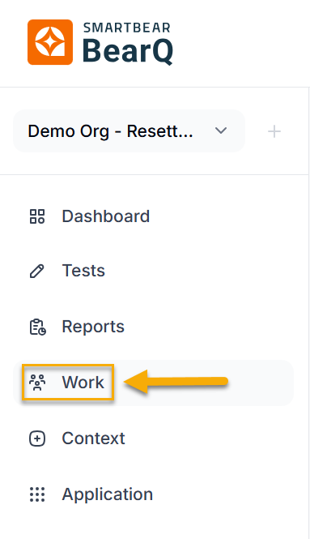
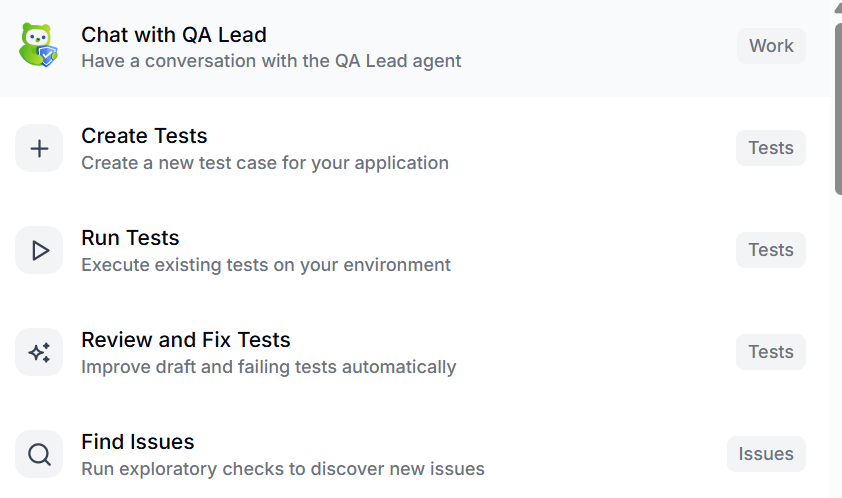
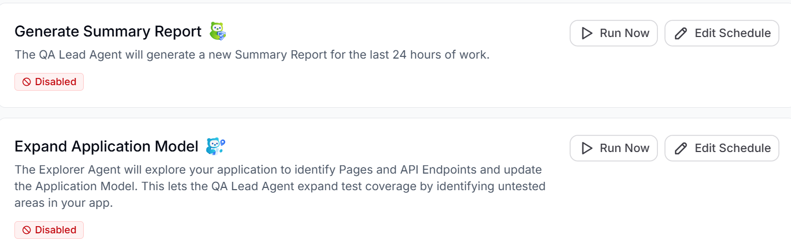
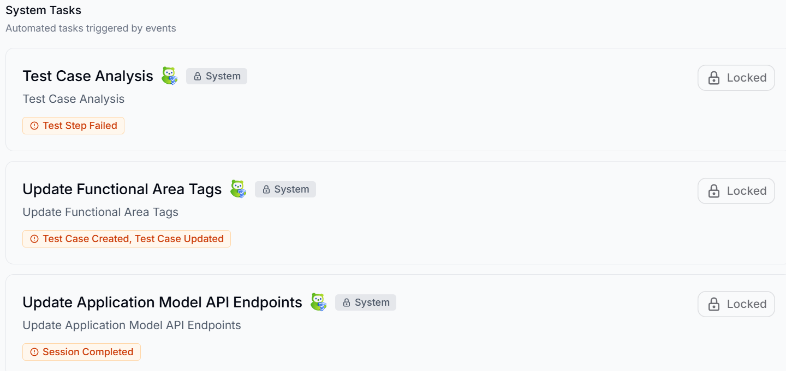
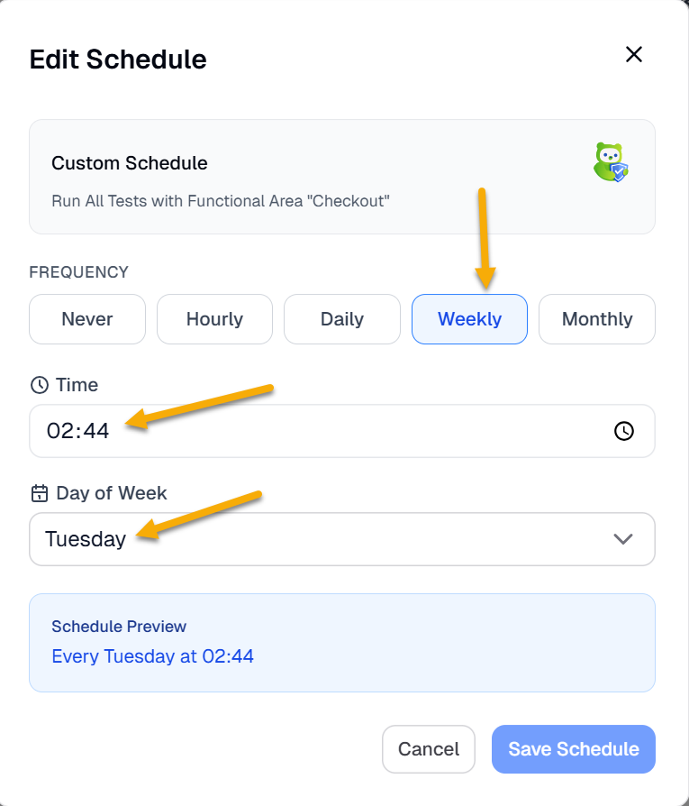
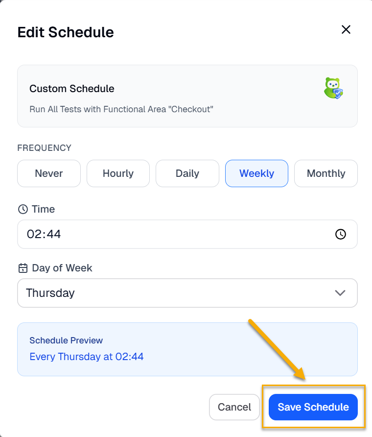
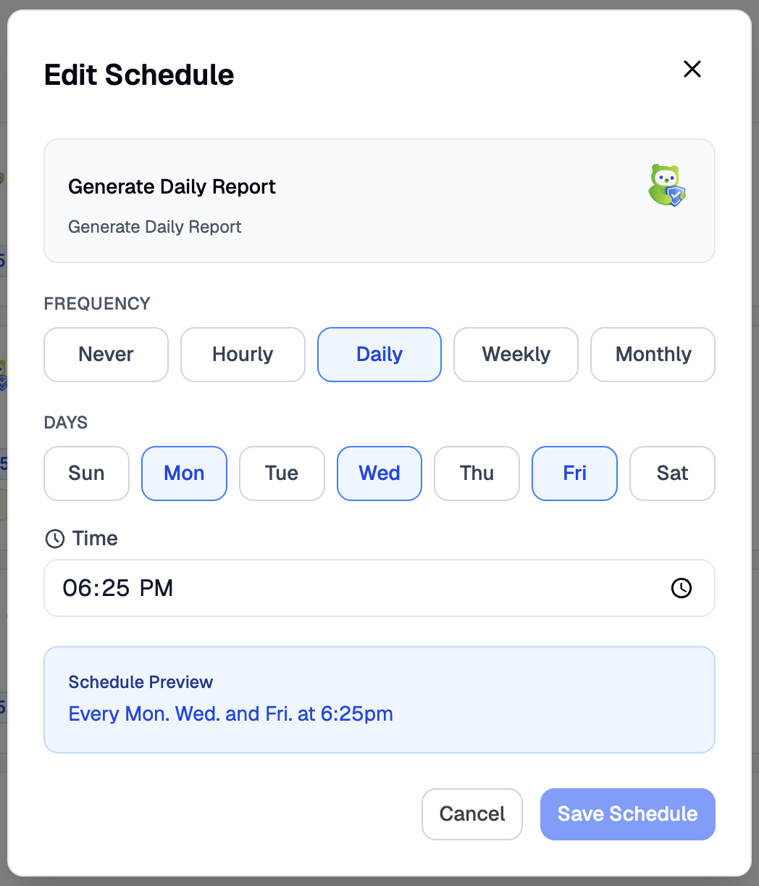
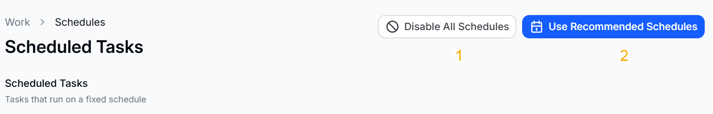

The work window allows you to **Chat with QA Lead, Give your Team a Task, and View Schedules**. It also shows the list of **Active Tasks** and **Completed Tasks**.

To learn more about how to communicate with the QA lead agent, read [Communicating with the QA lead agent](/bearq-agents/qa-quality-assurance-lead/).

To give your team a task, do the following:

1. Log in to BearQ.
2. Click **Work**.

   
3. Click **Give your Team a Task**.

   
4. Select any of the given tasks from the dropdown menu. The task will be executed by the relevant agent.

   

To view schedules, do the following:

1. Log in to BearQ.
2. Click **Work**.
3. Click **View Schedules**.

   
4. There are two types of tasks available:

   - **Scheduled Tasks**: You can edit the scheduled tasks.

     
   - **System Tasks**: These tasks are locked, so you cannot edit their schedules.

     

## Editing Schedules

You can edit the schedules by doing the following:

1. Log in to BearQ.
2. Click **Work**.
3. Click **View Schedules**.

   
4. Click **Edit Schedules**.
5. You can set the **Frequency**, **Time**, and **Day of the week**.

   
6. Click **Save Schedule**.

   

If you want to schedule the tests daily, you can also select the days of the week when you want the schedule to run.

This is how you can easily edit the schedule.

:::note

1. **Disable All Schedules**: This button will disable all the schedules that have been created.

2. **Use Recommended Schedules**: This button will enable BearQ's recommended schedules. You can edit these at any time, but autonomously running tasks will increase ACU consumption.
:::
